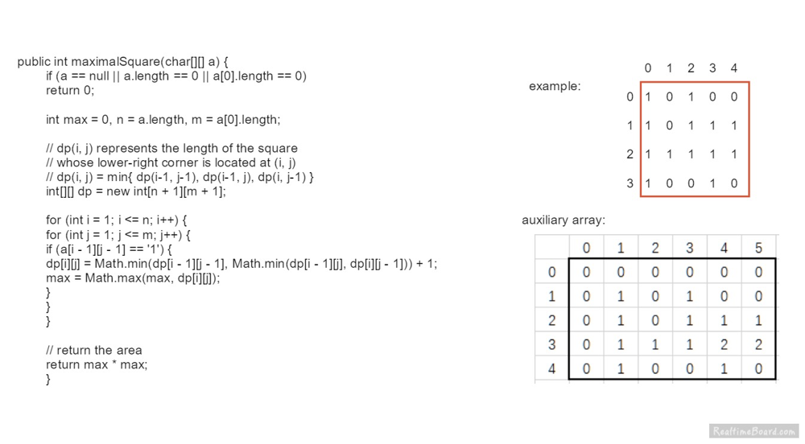

# Amazon Frequency 1~ 30

## 1: Two Sum

```java
class Solution {
    public int[] twoSum(int[] nums, int target) {
        int[] res = new int[2];
        if (nums == null || nums.length == 0 ) return res;
        HashMap<Integer, Integer> map = new HashMap<>();
        for (int i = 0; i < nums.length; i ++) {
            if (map.containsKey(target - nums[i])){
               int index1 = map.get(target - nums[i]);
               res[0] = index1;
               res[1] = i; 
            } else {
                map.put(nums[i], i);
            }
        }
        
        return res;
    }
}
```

## 42-Trapping Rain Water

```java
class Solution {
    public int trap(int[] height) {
        if (height == null || height.length == 0) return 0;
        int left = 0; int right = height.length - 1;
        int leftMax = height[left];
        int rightMax = height[right];
        int sum = 0;
        while (left <= right){
           leftMax = Math.max(leftMax, height[left]);
           rightMax = Math.max(rightMax, height[right]);
           if (leftMax < rightMax){
               sum += leftMax - height[left];
               left ++;
           } else {
               sum += rightMax - height[right];
               right --;
           }
            
        }
        return sum;
    }
}
```

## 200 Number of Islands

```java
//BFS
class Solution {  
    public int numIslands(char[][] grid) {
        int[][] directions = {{-1, 0}, {0, -1}, {1, 0}, {0, 1}};
        int r = grid.length;
        int c = grid[0].length;
        boolean[] marked = new boolean[r * c];
        int count = 0;
        for (int i = 0; i < r; i ++) {
            for (int j = 0; j < c; j ++) {
             if (!marked[i * c + j] && grid[i][j] == '1') {
                 count++;
                 int index = i * c + j;
                 LinkedList<Integer> queue = new LinkedList<>();
                 queue.offer(index);
                 marked[i * c + j] = true;
                 while (!queue.isEmpty()) {
                     int cur = queue.poll();
                     int curX = cur / c;
                     int curY = cur % c;
                     for (int k = 0; k < 4; k ++) {
                        int nextX = curX + directions[k][0];
                        int  nextY = curY + directions[k][1];
                         if (inArea(r,c,nextX, nextY) && grid[nextX][nextY] == '1' && !marked[nextX * c + nextY]){
                             queue.offer(nextX * c + nextY);
                             marked[nextX * c + nextY] = true;
                         }
                     }
                  }   
               } 
            }
        }
        
        return count;      
    }
    
    public boolean inArea(int r, int c, int i, int j) {
        return i >= 0 && i < r && j >= 0 && j < c;
    }
}
// Union find
class Solution {
    public int numIslands(char[][] grid) {
        if (grid == null || grid.length == 0 || grid[0].length == 0) return 0;
        UnionFind uf = new UnionFind(grid);
        int r = grid.length;
        int c = grid[0].length;
        
        for (int i = 0; i < r; i ++){
            for (int j = 0; j < c; j ++){
                if (i + 1 < r && grid[i][j] == '1' && grid[i][j] == grid[i+1][j]){
                    uf.union(i * c + j, (i + 1)* c + j);
                }
                if (j + 1 < c && grid[i][j] == '1' && grid[i][j] == grid[i][j + 1]){
                    uf.union(i * c + j, i * c + j + 1);
                }
            }
        }
        
        return uf.count;
        
    }
    
  class UnionFind{
      int[] parent;
      int count; 
      
      public UnionFind(char[][] grid){ 
          int r = grid.length;
          int c = grid[0].length;
          parent = new int[r*c];
          count = 0;
          for (int i = 0; i < r; i ++){
              for (int j = 0; j < c; j ++){
                  if(grid[i][j] == '1'){
                      parent[i * c + j] = i * c + j;
                      count ++;
                  }
              }
          }
          
      }
      
      public int find(int p, int[] parent){
          if (p == parent[p]) {
              return p;
          }
          parent[p] = find(parent[p], parent);
          return parent[p];
      }
      
      public void union(int p , int f){
          int p1 = find(p, parent); int f1 = find(f, parent);
          if (p1 != f1){
              parent[p1] = f1;
              count --;
          }
      }
  }  
    
    
}

// DFS
class Solution {
    public int numIslands(char[][] grid) {
        if (grid == null || grid.length == 0 || grid[0].length == 0) return 0;
        int r = grid.length;
        int c = grid[0].length;
        int res = 0;
    //    boolean[][] visted = new boolean[r][c];
        for (int i = 0; i < r; i ++){
            for (int j = 0; j < c; j ++){
                if (grid[i][j] == '1'){
                    searchIsland(grid,i,j);
                    res ++;
                }               
            }
        }
        return res;
    }
        
    public void searchIsland(char[][] grid, int row, int col) {
        if(!inArea(grid,row, col)) return;
        if(grid[row][col] != '1') return;
        grid[row][col] = '2';
        searchIsland(grid, row - 1, col);
        searchIsland(grid, row + 1, col);
        searchIsland(grid, row, col - 1);
        searchIsland(grid, row, col + 1);
    }
    
    public boolean inArea(char[][] grid, int row, int col){
        return row >= 0 && row < grid.length && col >= 0 && col < grid[0].length;
    }
    
}
```

## 146-LRU Cache

```java
class Node {
    int key, value;
    Node pre, next;
    public Node (int key, int value) {
        this.key = key;
        this.value = value;
    }
}

class DoubleList {
    Node head;
    Node tail;
    int size;
    public DoubleList(int size){
        this.size = size;
        head = new Node(-1,-1);
        tail = new Node(-1,-1);
        head.next = tail;
        tail.pre = head;  
    }
    
    public void remove(Node node) {
        node.pre.next = node.next;
        node.next.pre = node.pre;
        node.pre = null;
        node.next = null;
        size --;
    }
    
    public void addFirst(Node node) {
        node.next = head.next;
        node.pre = head;
        head.next.pre = node;
        head.next = node;
        size ++;
    }
    
    public Node removeLast() {
        if (tail.pre == head){
            return null;
        }
        Node node = tail.pre;
        remove(node);
        return node;
    }
    
    public int getSize() {
        return this.size;
    }
    
}

class LRUCache {
    DoubleList cache;
    HashMap<Integer, Node> map;
    int capacity;

    public LRUCache(int capacity) {
        this.capacity = capacity;
        cache = new DoubleList(0);
        map = new HashMap<>();
    }
    
    public int get(int key) {
        if (!map.containsKey(key)){
            return -1;
        }
        Node node = map.get(key);
        put(key, node.value);
        return node.value;
        
    }
    
    public void put(int key, int value) {
        if(map.containsKey(key)){
           Node node = map.get(key);
            cache.remove(node);
            node.value = value;
            map.put(key,node);
            cache.addFirst(node);
            return;
        }
        if (cache.getSize() == capacity){
           Node lastNode = cache.removeLast();
           map.remove(lastNode.key); 
        }
        Node newNode = new Node(key,value);
        map.put(key,newNode);
        cache.addFirst(newNode);
    }
}
```

## 937-Reorder Data in Log Files

```java
You have an array of logs.  Each log is a space delimited string of words.
For each log, the first word in each log is an alphanumeric identifier.  
Then, either:
Each word after the identifier will consist only of lowercase letters, or;
Each word after the identifier will consist only of digits.
We will call these two varieties of logs letter-logs and digit-logs.  
It is guaranteed that each log has at least one word after its identifier.
Reorder the logs so that all of the letter-logs come before any digit-log.  
The letter-logs are ordered lexicographically ignoring identifier, with the 
identifier used in case of ties.  The digit-logs should be put in their original
order. Return the final order of the logs.

Example 1:
Input: logs = ["dig1 8 1 5 1","let1 art can","dig2 3 6",
"let2 own kit dig","let3 art zero"]
Output: ["let1 art can","let3 art zero","let2 own kit dig",
"dig1 8 1 5 1","dig2 3 6"]

class Solution {
    public String[] reorderLogFiles(String[] logs) {
        List<String> letterLogs = new ArrayList<>();
        List<String> numLogs = new ArrayList<>();
        // 将字母日志和数字日志分开，分别放入两个list
        for (String log : logs) {
            int i = log.indexOf(" ") + 1;
            if (log.charAt(i) >= '0' && log.charAt(i) <= '9')
                numLogs.add(log);
            else
                letterLogs.add(log);
        }
        Collections.sort(letterLogs, (a,b) -> {
                // 取字母a日志的标识符及内容
                int ai = a.indexOf(" ");
                String ida = a.substring(0, ai);
                String loga = a.substring(ai + 1);

                // 取字母b日志的标识符及内容
                int bi = b.indexOf(" ");
                String idb = b.substring(0, bi);
                String logb = b.substring(bi + 1);
                
                // 对比二者内容，如果相同则对比标识符
                int cmp = loga.compareTo(logb);
                if (cmp == 0) 
                    return ida.compareTo(idb);
                return cmp;
            
        });
        letterLogs.addAll(numLogs);
        return letterLogs.toArray(new String[letterLogs.size()]);
    }
}


```

## 5-Longest Palindromic Substring

```java
class Solution {
    int lo = 0; int maxLen = 0;
    public String longestPalindrome(String s) {
        if (s.length() < 2) return s;
        for (int i = 0; i < s.length(); i ++) {
            extendedPalindrome(s, i , i);
            extendedPalindrome(s, i, i + 1);
        }
        return s.substring(lo, lo + maxLen);
    }
    public void extendedPalindrome(String s, int l, int r){
      //  int l = left; int r = right; //作用域
        while (l >= 0 && l < s.length() && r >= 0 && r < s.length() && s.charAt(l) == s.charAt(r)){
            l --;
            r ++;
        }
        if (maxLen < r - l - 1){ // 
            lo = l + 1;
            maxLen = r - l - 1;
        }
    }
}
```

## 21-Merge Two Sorted Lists

```java
class Solution {
    public ListNode mergeTwoLists(ListNode l1, ListNode l2) {
        if (l1 == null) return l2;
        if (l2 == null) return l1;
        if (l1.val < l2.val){
            l1.next = mergeTwoLists(l1.next, l2);
            return l1;
        }
        l2.next = mergeTwoLists(l1, l2.next);
        return l2;
        }
        
    }

```

## 763-Partition Labels

```java
A string S of lowercase English letters is given.
 We want to partition this string into as many parts as possible so that each 
 letter appears in at most one part, and return a list of integers 
 representing the size of these parts.
Example 1:
Input: S = "ababcbacadefegdehijhklij"
Output: [9,7,8]
Explanation:
The partition is "ababcbaca", "defegde", "hijhklij".
This is a partition so that each letter appears in at most one part.
A partition like "ababcbacadefegde", "hijhklij" 
is incorrect, because it splits S into less parts.

class Solution {
    public List<Integer> partitionLabels(String S) {
        if(S == null || S.length() == 0){
            return null;
        }
        List<Integer> list = new ArrayList<>();
        int[] map = new int[26];  
       // record the last index of the each char
        for(int i = 0; i < S.length(); i++){
            map[S.charAt(i)-'a'] = i;
        }
        // record the end index of the current sub string
        int last = 0;
        int start = 0;
        for(int i = 0; i < S.length(); i++){
            last = Math.max(last, map[S.charAt(i)-'a']);
            if(last == i){
                list.add(last - start + 1);
                start = last + 1;
            }
        }
        return list;
    }
}
```

## 56.Merge Intervals

```java
class Solution {
    public int[][] merge(int[][] intervals) {
        Arrays.sort(intervals, (a,b) -> a[0] - b[0]); // -> not =>
        int k = 0;
        int i = 0;
        while (i < intervals.length) {
            int start = intervals[i][0];
            int end = intervals[i][1];
            while (i < intervals.length - 1 && end >= intervals[i + 1][0]){ 
            // test overlap need to first check end with next start
                i ++;
                end = Math.max(intervals[i][1], end);
            }
            intervals[k][0] = start;
            intervals[k][1] = end;
            k ++;
            i ++; 
        }
        return Arrays.copyOf(intervals, k);
    }
}
```

## 238-Product of Array Except Self

```java
class Solution {
    public int[] productExceptSelf(int[] nums) {
        int n = nums.length;
        int[] front = new int[n]; int[] back = new int[n]; int[] res = new int[n];
        front[0] = 1;
        back[n - 1] = 1;
        for (int i = 1; i < n; i ++) {
            front[i] = nums[i - 1] * front[i - 1];
        }
        
        for (int j = n - 2; j >= 0; j --) {
            back[j] = back[j + 1] * nums[j + 1];
        }
        
        for (int i = 0; i < n; i ++) {
            res[i] = front[i] * back[i];
        }
        return res;
    }
}
```

## 23-Merge k Sorted Lists

```java
class Solution {
    public ListNode mergeKLists(ListNode[] lists) {
        
       // if(lists == null || lists.length == 0) return null;
        PriorityQueue<ListNode> pq = new PriorityQueue<>((l1,l2)-> l1.val - l2.val);
        ListNode head = new ListNode(-1);
        ListNode cur = head;
        for(int i = 0; i < lists.length; i ++){
            if(lists[i] != null){
             pq.offer(lists[i]);   
            }
        }
        while(!pq.isEmpty()){
            ListNode temp = pq.poll();
            cur.next = temp;
            cur = cur.next;
            if(temp.next != null){
                pq.offer(temp.next);
            }
        }
        return head.next;
    }
}
```

## 273-Integer to English Words

```java
class Solution {
    public String numberToWords(int num) {
        if(num == 0) return "Zero";
        return helper(num);  
    }
    
    public String helper(int num ) {
        String[] words = new String[] {"", "One", "Two", "Three", "Four", "Five", "Six", "Seven", "Eight", "Nine", "Ten",
                                      "Eleven", "Twelve", "Thirteen", "Fourteen", "Fifteen", "Sixteen", "Seventeen",
                                       "Eighteen", "Nineteen"}; // Fifteen, Twelve Forty Nineteen Ninety Hundred
        String[] words1 = new String[]{"","","Twenty ", "Thirty ", "Forty ", "Fifty ", "Sixty ",  "Seventy ", "Eighty ", "Ninety "};
       StringBuilder sb = new StringBuilder();
        if (num >= 1000000000) {
            sb.append(helper(num/1000000000)).append(" Billion ");
            num %= 1000000000; 
        }
        if (num >= 1000000) {
            sb.append(helper(num/1000000)).append(" Million ");
            num %= 1000000; 
        }
        if (num >= 1000) {
            sb.append(helper(num/1000)).append(" Thousand ");
            num %= 1000; 
        }
        if (num >= 100) {
            sb.append(helper(num/100)).append(" Hundred ");
            num %= 100; 
        }
        if (num >= 20) {
             sb.append(words1[num/10]).append(words[num%10]);
        } else {
          sb.append(words[num]);  
        }
        
        return sb.toString().trim();
        
    }
}
```

## 139-Word Break


```java
方法一：动态规划

初始化 dp=[False,\cdots,False]dp=[False,⋯,False]，长度为 n+1n+1。
nn 为字符串长度。dp[i]dp[i] 表示 ss 的前 ii 位是否可以用 wordDictwordDict 中的单词表示。
初始化 dp[0]=Truedp[0]=True，空字符可以被表示。
遍历字符串的所有子串，遍历开始索引 ii，遍历区间 [0,n)[0,n)：
遍历结束索引 jj，遍历区间 [i+1,n+1)[i+1,n+1)：
若 dp[i]=Truedp[i]=True 且 s[i,\cdots,j)s[i,⋯,j) 
在 wordlistwordlist 中：dp[j]=Truedp[j]=True。解释：dp[i]=Truedp[i]=True 
说明 ss 的前 ii 位可以用 wordDictwordDict 表示，则 s[i,\cdots,j)s[i,⋯,j) 
出现在 wordDictwordDict 中，说明 ss 的前 jj 位可以表示。
返回 dp[n]dp[n]
复杂度分析
时间复杂度：O(n^{2})O(n 
2
 )
空间复杂度：O(n)O(n)

class Solution {
    public boolean wordBreak(String s, List<String> wordDict) {
        boolean[] dp = new boolean[s.length() + 1];
        Set<String> set = new HashSet<>(wordDict);
        dp[0] = true;
        for (int i = 1; i <= s.length(); i++) {
            for (int j = 0; j < i; j++) {
                if (dp[j] && set.contains(s.substring(j, i))){
                    dp[i] = true;
                    break;
                }
            }
        }
        return dp[s.length()];
    }
}
```

## 973-K Closest Points to Origin

```java
class Solution {
    public int[][] kClosest(int[][] points, int K) {
    PriorityQueue<int[]> pq = new PriorityQueue<int[]>((p1,p2) -> p2[0] * p2[0] + p2[1] * p2[1] - p1[0] * p1[0] - p1[1] * p1[1]);
    for (int i = 0; i < points.length; i ++){
        pq.offer(points[i]);
        if (pq.size() > K){
            pq.poll();
        }
    }
    int[][] res = new int[K][2];
                                                    
    for (int i = K - 1; i >= 0; i --){
        res[i] = pq.poll();
    }
     return res;                                               
    }
}
```

## 221-Maximal Square



```java
Given a 2D binary matrix filled with 0's and 1's, find
the largest square containing only 1's and return its area.
Example:
Input: 
1 0 1 0 0
1 0 1 1 1
1 1 1 1 1
1 0 0 1 0
Output: 4

dp[i][j] represents the length of the square which lower right corner 
is located at (i, j).
If the value of this cell is also 1, then the length of the square is the 
minimum of: the one above, its left, and diagonal up-left value +1. 
Because if one side is short or missing, it will not form a square.

class Solution {
    public int maximalSquare(char[][] matrix) {
      if(matrix.length == 0) return 0;
      int m = matrix.length, n = matrix[0].length;
      int[][] dp = new int[m + 1][n + 1];
   
      int maxEdge = 0;      
      for(int i = 1; i <= m; i++){
        for(int j = 1; j <= n; j++){
          if(matrix[i - 1][j - 1] == '1'){
            dp[i][j] = Math.min(Math.min(dp[i - 1][j], dp[i][j - 1]),
            dp[i - 1][j - 1]) + 1;
            maxEdge = Math.max(maxEdge, dp[i][j]);
          }
        }
      }
      
      return maxEdge * maxEdge;  
    }
}
```

## 819- Most Common Word

```java
paragraph = "Bob hit a ball, the hit BALL flew far after it was hit."
banned = ["hit"]
Output: "ball"
Explanation: 
"hit" occurs 3 times, but it is a banned word.
"ball" occurs twice (and no other word does), 
so it is the most frequent non-banned word in the paragraph. 

class Solution {
    public String mostCommonWord(String paragraph, String[] banned) {
        if (paragraph.length()==0) {
            return "";
        }
        String result = "";
        HashMap<String, Integer> map = new HashMap<>();
        String[] words = paragraph.replaceAll("\\W+" , " ")
                         .toLowerCase().split("\\s+");
        for (String word : words) {
            if (map.containsKey(word)){
                map.put(word,map.get(word) + 1);
            } else {
                map.put(word,1);
            }
        }
        
        for (String ban : banned) {
            if (map.containsKey(ban)) {
                map.remove(ban);
            }
        }
        for (Map.Entry<String, Integer> wordEntry : map.entrySet()) {
         if (result.length() == 0 || wordEntry.getValue() > map.get(result)) {
            result = wordEntry.getKey();
         }
      }
       return result;
    }
}
```

## 

