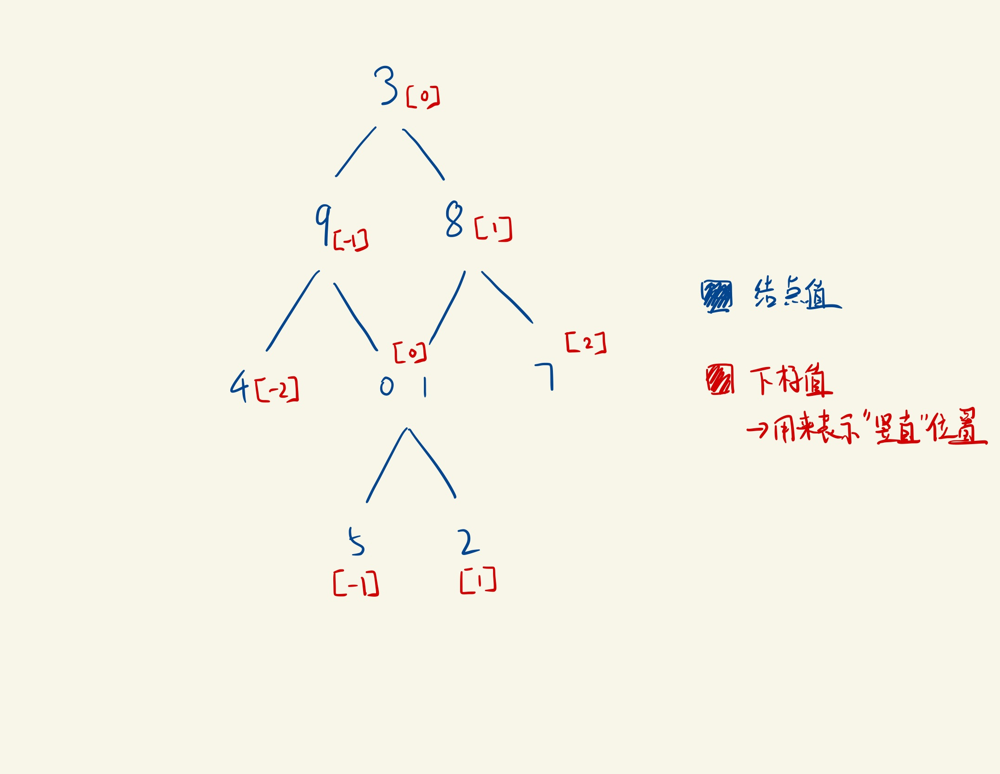

# FaceBook Frequency 50-100

## 249 Group Shifted Strings

```java
Given a string, we can "shift" each of its letter to its successive 
letter, for example: "abc" -> "bcd". We can keep "shifting" which 
forms the sequence:
"abc" -> "bcd" -> ... -> "xyz"
Input: ["abc", "bcd", "acef", "xyz", "az", "ba", "a", "z"],
Output: 
[
  ["abc","bcd","xyz"],
  ["az","ba"],
  ["acef"],
  ["a","z"]
]

public class Solution {
    public List<List<String>> groupStrings(String[] strings) {
        List<List<String>> result = new ArrayList<List<String>>();
        Map<String, List<String>> map = new HashMap<String, List<String>>();
        for (String str : strings) {
            int offset = str.charAt(0) - 'a';
            String key = "";
            for (int i = 0; i < str.length(); i++) {
                char c = (char) (str.charAt(i) - offset);
                if (c < 'a') {
                    c += 26;
                }
                key += c;
            }
            if (!map.containsKey(key)) {
                List<String> list = new ArrayList<String>();
                map.put(key, list);
            }
            map.get(key).add(str);
        }
        for (String key : map.keySet()) {
            List<String> list = map.get(key);
            Collections.sort(list);
            result.add(list);
        }
        return result;
    }
}

```

## 852 - Friends Of Appropriate Ages

```java
Some people will make friend requests. The list of their ages is given
 and ages[i] is the age of the ith person. 
Person A will NOT friend request person B (B != A) if any of the following 
conditions are true:
age[B] <= 0.5 * age[A] + 7
age[B] > age[A]
age[B] > 100 && age[A] < 100
Otherwise, A will friend request B.
Note that if A requests B, B does not necessarily
 request A.  Also, people will not friend request themselves.
How many total friend requests are made?

Input: [16,16]
Output: 2
Explanation: 2 people friend request each other.
Input: [16,17,18]
Output: 2
Explanation: Friend requests are made 17 -> 16, 18 -> 17.

class Solution {
    public int numFriendRequests(int[] ages) {
        Map<Integer, Integer> count = new HashMap<>();
        for (int age : ages) //最多120个
            count.put(age, count.getOrDefault(age, 0) + 1);
        int res = 0;
        for (Integer a : count.keySet())
            for (Integer b : count.keySet())
                if (request(a, b)) res += count.get(a) * 
                     (count.get(b) - (a == b ? 1 : 0));
        return res;
    }

    private boolean request(int a, int b) {
        return !(b <= 0.5 * a + 7 || b > a || (b > 100 && a < 100));
    }
}
```

## 20 Divide Two Integers

```java
Given two integers dividend and divisor, 
divide two integers without using multiplication, division, 
and mod operator.
Input: dividend = 10, divisor = 3
Output: 3
Explanation: 10/3 = truncate(3.33333..) = 3.

Return the quotient after dividing dividend by divisor.
We know that division is actually the backward of multiplication, 
for example , 20 / 5 = 4 can be seen as 4 * 5 = 20. 
Here what we are going to do is to find the multiplication.
 We set tmp as divisor (5) and set count to 1. 
 As long as the tmp is less than or equal to dividend (20), 
 we left shift << which is same as multiply 2 but without using multiplication.
 
class Solution {
    public int divide(int dividend, int divisor) {
        boolean isNegative = (dividend < 0 && divisor > 0) 
        || (dividend > 0 && divisor < 0) ? true : false;
        long absDividend = Math.abs((long) dividend);
        long absDivisor = Math.abs((long) divisor);
        long result = 0;
        while (absDividend >= absDivisor) {
            long temp = absDivisor, count = 1;
            while (temp <= absDividend) {
                temp <<= 1;
                count <<= 1;
            }
            result += count >> 1;
            absDividend -= temp >> 1;
        }
        return isNegative ? (int) ~result + 1 
        : (result > Integer.MAX_VALUE ? Integer.MAX_VALUE : (int) result);
    }
}
// https://leetcode.com/problems/divide-two-integers/discuss/13467
// /Very-detailed-step-by-step-explanation-(Java-solution)

```

## 1570  Dot Product of Two Sparse Vectors

```java
Given two sparse vectors, compute their dot product.
Implement class SparseVector:
SparseVector(nums) Initializes the object with the vector nums
dotProduct(vec) Compute the dot product between the instance of 
SparseVector and vec
A sparse vector is a vector that has mostly zero values,
 you should store the sparse vector efficiently and compute the 
 dot product between two SparseVector.
Follow up: What if only one of the vectors is sparse?

class SparseVector {

    public static void main(String[] args) {
        int[] nums1 = new int[]{1,0,0,2,3};
        int[] nums2 = new int[]{0,3,0,4,0};
        SparseVector v1 = new SparseVector(nums1);
        SparseVector v2 = new SparseVector(nums2);
        System.out.println(v1.dotProduct(v2)); // 8
    }
    
     Map<Integer, Integer> indexMap = new HashMap<>();
     int n;
     SparseVector(int[] nums) {
         n = nums.length;
        for (int i = 0; i < nums.length; i++) {
            if (nums[i] != 0)
                indexMap.put(i, nums[i]);
        }
    }

    // Return the dotProduct of two sparse vectors
    public int dotProduct(SparseVector vec) {
        if (indexMap.size() == 0 || vec.indexMap.size() == 0) return 0;
        if (indexMap.size() > vec.indexMap.size())
            return vec.dotProduct(this);  
            // 如果是一疏一密 就把疏的那个作为探测ENTRYSET 然后在密的当中找KEY
        int productSum = 0;
        for (Map.Entry<Integer, Integer> entry : indexMap.entrySet()) {
            int index = entry.getKey();
            if(vec.indexMap.containsKey(index)){
                productSum += (entry.getValue() * vec.indexMap.get(index));
            }
        }
        return productSum;
    }
}
```

## 398  Random Pick Index

```java

public class Solution {
    int[] nums;
    Random rnd;

    public Solution(int[] nums) {
        this.nums = nums;
        this.rnd = new Random();
    }
    
    public int pick(int target) {
        int result = -1;
        int count = 0;
        for (int i = 0; i < nums.length; i++) {
            if (nums[i] != target)
                continue;
            if (rnd.nextInt(++count) == 0)
                result = i;
        }
        
        return result;
    }
}
```

## 34  Find First and Last Position of Element in Sorted Array

```java
//Input: nums = [5,7,7,8,8,10], target = 8
//Output: [3,4]

class Solution {
   public int[] searchRange(int[] nums, int target) {
    int[] result = new int[2];
    result[0] = findFirst(nums, target);
    result[1] = findLast(nums, target);
    return result;
}

private int findFirst(int[] nums, int target){
    int idx = -1;
    int start = 0;
    int end = nums.length - 1;
    while(start <= end){
        int mid = (start + end) / 2;
        if(nums[mid] >= target){
            end = mid - 1;
        }else{
            start = mid + 1;
        }
        if(nums[mid] == target) idx = mid;
    }
    return idx;
}

private int findLast(int[] nums, int target){
    int idx = -1;
    int start = 0;
    int end = nums.length - 1;
    while(start <= end){
        int mid = (start + end) / 2;
        if(nums[mid] <= target){
            start = mid + 1;
        }else{
            end = mid - 1;
        }
        if(nums[mid] == target) idx = mid;
    }
    return idx;
}
}
```

## 339 Nested List Weight Sum

```java
//Input: [[1,1],2,[1,1]]
//Output: 10 
//Explanation: Four 1's at depth 2, one 2 at depth 1.

class Solution {
    int result;
    public int depthSum(List<NestedInteger> nestedList) {
        result = 0;
        dfs(nestedList, 1);
        return result;
    }
    private void dfs(List<NestedInteger> nestedList, int depth) {
        for (NestedInteger ni : nestedList) {
            if (ni.isInteger()) {
                result += ni.getInteger() * depth;
            } else {
                dfs(ni.getList(), depth + 1);
            }
        }
    }
}
```

## 721 Accounts Merge

```java
//accounts = [["John", "johnsmith@mail.com", "john00@mail.com"], 
//["John", "johnnybravo@mail.com"], ["John", "johnsmith@mail.com",
// "john_newyork@mail.com"], ["Mary", "mary@mail.com"]]
//Output: [["John", 'john00@mail.com', 'john_newyork@mail.com', 
//'johnsmith@mail.com'],  ["John", "johnnybravo@mail.com"], 
//["Mary", "mary@mail.com"]]
class Solution {
    public List<List<String>> accountsMerge(List<List<String>> accounts) {
        if (accounts.size() == 0) {
            return new ArrayList<>();
        }

        int n = accounts.size();
        UnionFind uf = new UnionFind(n);

        // Step 1: traverse all emails except names, 
        //if we have not seen an email before, put it with its index into map.
        // Otherwise, union the email to its parent index.
        Map<String, Integer> mailToIndex = new HashMap<>();
        for (int i = 0; i < n; i++) {
            for (int j = 1; j < accounts.get(i).size(); j++) {
                String curMail = accounts.get(i).get(j);
                if (mailToIndex.containsKey(curMail)) {
                    int preIndex = mailToIndex.get(curMail);
                    uf.union(preIndex, i);
                }
                else {
                    mailToIndex.put(curMail, i);
                }
            }
        }

        // Step 2: traverse every email list, find the parent of current 
        //list index and put all emails into the set list
        // that belongs to key of its parent index
        Map<Integer, Set<String>> disjointSet = new HashMap<>();
        for (int i = 0; i < n; i++) {
            // find parent index of current list index in parent array
            int parentIndex = uf.find(i);
            disjointSet.putIfAbsent(parentIndex, new HashSet<>());

            Set<String> curSet = disjointSet.get(parentIndex);
            for (int j = 1; j < accounts.get(i).size(); j++) {
                curSet.add(accounts.get(i).get(j));
            }
            disjointSet.put(parentIndex, curSet);
        }

        // step 3: traverse ket set of disjoint set group, retrieve all 
        //emails from each parent index, and then SORT
        // them, as well as adding the name at index 0 of every sublist
        List<List<String>> result = new ArrayList<>();
        for (int index : disjointSet.keySet()) {
            List<String> curList = new ArrayList<>();
            if (disjointSet.containsKey(index)) {
                curList.addAll(disjointSet.get(index));
            }
            Collections.sort(curList);
            curList.add(0, accounts.get(index).get(0));
            result.add(curList);
        }
        return result;
    }

    class UnionFind {
        int size;
        int[] parent;
        public UnionFind(int size) {
            this.size = size;
            this.parent = new int[size];

            for (int i = 0; i < size; i++) {
                parent[i] = i;
            }
        }

        public void union(int a, int b) {
            parent[find(a)] = parent[find(b)];
        }

        public int find(int x) {
            if (x != parent[x]) {
                parent[x] = find(parent[x]);
            }
            return parent[x];
        }
    }
}
```

## 340 Longest Substring with At Most K Distinct Characters

```java
// Input: s = "eceba", k = 2
//Output: 3
//Explanation: T is "ece" which its length is 3.
class Solution {
    public int lengthOfLongestSubstringKDistinct(String s, int k) {
        if (k < 1 || s == null || s.length() == 0) return 0;
        HashMap<Character, Integer> window = new HashMap<>();
        int left = 0; int right = 0; int max = 0;
        while (right < s.length()){
            char r = s.charAt(right);
            right ++;
            window.put(r, window.getOrDefault(r, 0) + 1);
            while (window.size() > k){
                char l = s.charAt(left);
                left ++;
                window.put(l, window.get(l)- 1);
                if(window.get(l) == 0){
                    window.remove(l);
                }
            }
            max = Math.max(max, right - left);
        }
        return max;
    }
}
```

## 270 Closest Binary Search Tree Value

```java
Input: root = [4,2,5,1,3], target = 3.714286

    4
   / \
  2   5
 / \
1   3

Output: 4

class Solution {
    public int closestValue(TreeNode root, double target) {
    int ret = root.val;   
    while(root != null){
        if(Math.abs(target - root.val) < Math.abs(target - ret)){
            ret = root.val;
        }      
        root = root.val > target? root.left: root.right;
    }     
    return ret;
  }
}
```

## 543 Diameter of Binary Tree

```java
Example:
Given a binary tree
          1
         / \
        2   3
       / \     
      4   5    
Return 3, which is the length of the path [4,2,1,3] or [5,2,1,3].

class Solution {
    int maxd = 0;
    public int diameterOfBinaryTree(TreeNode root) {
        depth(root);
        return maxd;
    }
    public int depth(TreeNode node){
        if(node==null){
            return 0;
        }
        int Left = depth(node.left);
        int Right = depth(node.right);
        maxd=Math.max(Left+Right,maxd);
        //将每个节点最大直径(左子树深度+右子树深度)当前最大值比较并取大者
        return Math.max(Left,Right)+1;//返回节点深度
        // 
    }
}
// https://leetcode-cn.com/problems/diameter-of-binary-tree
///solution/er-cha-shu-de-zhi-jing-by-leetcode-solution/
```

## 621 Task Scheduler


Given a characters array `tasks`, representing the tasks a CPU needs to do, where each letter represents a different task. Tasks could be done in any order. Each task is done in one unit of time. For each unit of time, the CPU could complete either one task or just be idle.

However, there is a non-negative integer `n` that represents the cooldown period between two **same tasks** \(the same letter in the array\), that is that there must be at least `n` units of time between any two same tasks.

Return _the least number of units of times that the CPU will take to finish all the given tasks_.

**Example 1:**

```text
Input: tasks = ["A","A","A","B","B","B"], n = 2
Output: 8
Explanation: 
A -> B -> idle -> A -> B -> idle -> A -> B
There is at least 2 units of time between any two same tasks.
```

```java

class Solution {
       public int leastInterval(char[] tasks, int n) {
        if (tasks.length <= 1 || n < 1) return tasks.length;
        //步骤1
        int[] counts = new int[26];
        for (int i = 0; i < tasks.length; i++) {
            counts[tasks[i] - 'A']++;
        }
        //步骤2
        Arrays.sort(counts);
        int maxCount = counts[25];
        int retCount = (maxCount - 1) * (n + 1) + 1;
        int i = 24;
        //步骤3
        while (i >= 0 && counts[i] == maxCount) {
            retCount++;
            i--;
        }
        //步骤4
        return Math.max(retCount, tasks.length); 
        // 如果按照最长的排完之后，后面还有剩下的没有排的，
        //比如字符串序列式AAABBBCCCD，然后n=2的话，那拍好就是ABCABCABCD，
        //按照公式计算出来的结果是(3-1)*(3)+1+2=9，但是实际的序列应该是ABCABCABCD，
        //应该是10，
        //所以通过求max来补充掉这个正好全排列但是还有多出去的情况
    }
}
```

## 314 Binary Tree Vertical Order Traversal



```java
class Solution {
  public List<List<Integer>> verticalOrder(TreeNode root) {
    List<List<Integer>> result = new ArrayList<>();
    if (root == null) return result;
    Map<Integer, List<Integer>> map = new HashMap<>();
    int min = 0, max = 0;
    Queue<TreeNode> queue = new LinkedList<>();
    Queue<Integer> helper = new LinkedList<>();
    queue.offer(root);
    helper.offer(0);

    while (!queue.isEmpty()) {
        int size = queue.size();
        for (int i = 0; i < size; i++) {
            TreeNode cur = queue.poll();
            int pos = helper.poll();
            min = Math.min(min, pos);
            max = Math.max(max, pos);
            if (!map.containsKey(pos)) map.put(pos, new ArrayList<>());
            map.get(pos).add(cur.val);
            if (cur.left != null) {
                queue.offer(cur.left);
                helper.offer(pos - 1);
            }
            if (cur.right != null) {
                queue.offer(cur.right);
                helper.offer(pos + 1);   
            }
        }
    }

    for (int i = min; i <= max; i++) result.add(- min + i, map.get(i));
    
    return result;
}

}
```

## 689 Maximum Sum of 3 Non-Overlapping Subarrays

```java
//This is a more general DP solution, and it is similar to
// that buy and sell stock problem.
//dp[i][j] stands for in i th sum, the max non-overlap
// sum we can have from 0 to j
//id[i][j] stands for in i th sum, the first starting index for that sum.

class Solution {
    public int[] maxSumOfThreeSubarrays(int[] nums, int k) {
        int[][] dp = new int[4][nums.length + 1];
        int sum = 0;
        int[] accu = new int[nums.length + 1];
        for(int i = 0; i < nums.length; i++) {
            sum += nums[i];
            accu[i] = sum;
        }
        int[][] id = new int[4][nums.length + 1];
        int max = 0, inId = 0;
        for(int i = 1; i < 4; i++) {
            for(int j = k-1 ; j < nums.length; j++) {
           int tmpmax = j - k < 0 ? accu[j] :
                         accu[j] - accu[j-k] + dp[i-1][j-k];
                if(j - k >= 0) {
                    dp[i][j] = dp[i][j-1];
                    id[i][j] = id[i][j-1];
                }
                if(j > 0 && tmpmax > dp[i][j-1]) {
                    dp[i][j] = tmpmax;
                    id[i][j] = j-k+1;
                }
            }
        }
        int[] res = new int[3];
        res[2] = id[3][nums.length-1];
        res[1] = id[2][res[2] - 1];
        res[0] = id[1][res[1] - 1];        
        return res;
    }
}
```

## 1026 Maximum Difference Between Node and Ancestor

```java
class Solution {
    int res = 0;
    public int maxAncestorDiff(TreeNode root) {
        if (root == null) return 0;
        dfs(root, root.val, root.val);
        return res;
    }
   // 最大差值一定是ancestors里面的最大值或最小值跟当前值的差值的绝对值。
    //因此只保存最大和最新的ancestor值即可 
    private void dfs(TreeNode node, int min, int max) {
        if (node == null) return;
        min = Math.min(node.val, min);
        max = Math.max(node.val, max);
        res = Math.max(res, Math.max(Math.abs(max - node.val),
                         Math.abs(min - node.val)));
        dfs(node.left, min, max);
        dfs(node.right, min, max);
    }
}
```

## 986 Interval List Intersections

```java
Input: A = [[0,2],[5,10],[13,23],[24,25]], 
B = [[1,5],[8,12],[15,24],[25,26]]
Output: [[1,2],[5,5],[8,10],[15,23],[24,24],[25,25]]

class Solution {
    public int[][] intervalIntersection(int[][] A, int[][] B) {
        int i = 0; int j = 0; int k = 0; 
        int al = A.length; int bl = B.length; 
        int[][] res = new int[al + bl][2];
        while (i < a1 && j < b1){
            int a1 = A[i][0]; int a2 = A[i][1];
            int b1 = B[j][0]; int b2 = B[j][1];
            if (b1 <= a2 && b2 >= a1) {
                res[k][0] = Math.max(a1, b1);
                res[k][1] = Math.min(a2,b2);
                k ++;
            }
            if (a2 < b2){
                i ++;
            } else {
                j ++;
            }
        }
        return Arrays.copyOf(res, k);
        // ans.toArray(new int[0][]);
    }
}
```

## 227 Basic Calculator II

```java
Input: "3+2*2"
Output: 7
class Solution {
    public int calculate(String s) {
        if (s.isEmpty()) {
            return 0;
        }
        int num = 0;
        int len = s.length();
        Stack<Integer> stack = new Stack<>();//存符号两边的数字
        char sign = '+';
        
        for (int i = 0; i < len; i++) {
            char ch = s.charAt(i);
            if (Character.isDigit(ch)) {
             //   num = Integer.valueOf(ch);
                num = num * 10 + (ch - '0'); //n有可能是上一轮的数字 多位数的多个数字
                
            }
            if ((!Character.isDigit(ch) && //不是数字，是符号
                ch != ' ') || //不是空格
               i == len - 1) { //因为是判断上一轮的符号 所以最后一个数字会错过
                
                // 加法和减法是直接push，加正数和负数的区别
                if (sign == '+') {
                    stack.push(num); // 不能CONTINUE 因为后面还要设置符号
                }
                if (sign == '-') {
                    stack.push(-num);
                }
                //乘法和除法是先计算两旁的数再push
                if (sign == '*') {
                    stack.push(stack.pop() * num); 
                    //stack中最顶上的数字是当前符号的前一个数字
                }
                if (sign == '/') {
                    stack.push(stack.pop() / num);
                }
                sign = ch; 
                //更新当前sign的符号，下一次循环根据sign的值处理该sign两边的数字
                num = 0;
            }
        }
        
        int result = 0;
        //循环做完后，所有乘法和除法也做完并push了，目前stack里面只剩加法和减法符号
        for (int ele : stack) { //这样遍历是先进先出（顺序不影响）
            result += ele;
        }
        
        return result;
    }
}
```

## 23 Merge k Sorted Lists

```java
class Solution {
    public ListNode mergeKLists(ListNode[] lists) {
        
       // if(lists == null || lists.length == 0) return null;
        PriorityQueue<ListNode> pq = 
        new PriorityQueue<>((l1,l2)-> l1.val - l2.val);
        ListNode head = new ListNode(-1);
        ListNode cur = head;
        for(int i = 0; i < lists.length; i ++){
            if(lists[i] != null){
             pq.offer(lists[i]);   
            }
        }
        while(!pq.isEmpty()){
            ListNode temp = pq.poll();
            cur.next = temp;
            cur = cur.next;
            if(temp.next != null){
                pq.offer(temp.next);
            }
        }
        return head.next;
    }
}
```

## 75 Is Graph Bipartite?

```java
public class Solution {
    private boolean[] visited;
    private int[] colors;
    private int[][] graph;
    
    public boolean isBipartite(int[][] graph) {
        this.graph = graph;
        int V = graph.length;
        visited = new boolean[V];
        colors = new int[V];
        for(int v = 0; v < V; v ++)
            if(!visited[v])
                if(!dfs(v, 0)) return false;
        return true;
    }

    private boolean dfs(int v, int color){
        visited[v] = true;
        colors[v] = color;
        for(int w: graph[v])
            if(!visited[w]){
                if(!dfs(w, 1 - color)) return false;
            }
            else if(colors[v] == colors[w])
                return false;
        return true;
    }
}
```

## 56 Merge Intervals

```java
class Solution {
    public int[][] merge(int[][] intervals) {
        Arrays.sort(intervals, (a,b) -> a[0] - b[0]); // -> not =>
        int k = 0;
        int i = 0;
        while (i < intervals.length) {
            int start = intervals[i][0];
            int end = intervals[i][1];
            while (i < intervals.length - 1 && 
            end >= intervals[i + 1][0]){ 
            // overlap need to first compare end with next start
                i ++;
                end = Math.max(intervals[i][1], end);
                // need to check bigger one, since previous just check overlap.
            }
            intervals[k][0] = start;
            intervals[k][1] = end;
            k ++;
            i ++; 
        }
        return Arrays.copyOf(intervals, k);
    }
}
```

## 50 Pow\(x, n\)

```java
class Solution {
    public double myPow(double x, int n) {
        if (n < 0) {
            x = 1/x;
            n = -n;
        }
        return myNewPow( x, n);
    }
    
    public double myNewPow(double x, int n) { 
    // double type need to keep not int.
        if (n == 0) return 1.00; // 1.00 not 1
        if (n == 1) return x;
        double half = myNewPow(x, n/2); // 后续遍历
        if (n % 2 == 0){  
            return half * half;
        } else {
            return half * half * x;     
        }
    }
}
```

## 333- Largest BST Subtree

```java
一棵树如果是二叉搜索树，那么它的左右子树也必然是二叉搜索树，
则对于一个节点为根的子树，如果我们已经知道了左右子树是不是二叉搜索树，
以及左右子树的值的范围 [l,r][l,r] ，那么如果左右子树均为二叉搜索树，
根据性质我们只要判断该节点的值是不是大于左子树的最大值和小于右子树的最小值
即能推断出该节点为根的子树是不是二叉搜索树，而又因为我们已经拿到了左右子树的信息


class Solution {

    class Result {
        TreeNode node; // BST根节点
        int size; // BST的size
        int max; // BST的最大值
        int min; // BST的最小值
    }

    public int largestBSTSubtree(TreeNode root) {
        Result r = visit(root);
        return r == null ? 0 : r.size;
    }

    public Result visit(TreeNode node) {
        if (node == null) return null;

        Result l = null, r = null;
        if (node.left != null) l = visit(node.left);
        if (node.right != null) r = visit(node.right);

        // 当前树为BST
    boolean lValid = (l == null || (l.node == node.left && l.max < node.val));
    boolean rValid = (r == null || (r.node == node.right && r.min > node.val));
        if (lValid && rValid) {
            Result result = new Result();
            result.node = node;
            result.max = r == null ? node.val : r.max;
            result.min = l == null ? node.val : l.min;
            result.size = (l == null ? 0 : l.size) + (r == null ? 0 : r.size) + 1;
            return result;
        }

        // 左右子树中找到了BST
        if (l != null && r != null) {
            return l.size > r.size ? l : r;
        }
        if (l != null) return l;
        if (r != null) return r;

        return null;
    }
}

```

## 200- Number of Islands

```java
public class Solution {
    private int rows;
    private int cols;

    public int numIslands(char[][] grid) {
        //           x-1,y
        //  x,y-1    x,y      x,y+1
        //           x+1,y
        int[][] directions = {{-1, 0}, {0, -1}, {1, 0}, {0, 1}};

        rows = grid.length;
        if (rows == 0) {
            return 0;
        }
        cols = grid[0].length;
        boolean[] marked = new boolean[rows * cols];
        int count = 0;
        for (int i = 0; i < rows; i++) {
            for (int j = 0; j < cols; j++) {
                if (!marked[i * cols + j] && grid[i][j] == '1') {
                    count++;
                    LinkedList<Integer> queue = new LinkedList<>();
                    queue.addLast(i * cols + j);
                    marked[i * cols + j] = true;
                    while (!queue.isEmpty()) {
                        int cur = queue.removeFirst();
                        int curX = cur / cols;
                        int curY = cur % cols;
                        // 得到 4 个方向的坐标
                        for (int k = 0; k < 4; k++) {
                            int newX = curX + directions[k][0];
                            int newY = curY + directions[k][1];
                            if (inArea(newX, newY) && grid[newX][newY] 
                              == '1' && !marked[newX * cols + newY]) {
                                queue.addLast(newX * cols + newY);
                                marked[newX * cols + newY] = true;
                            }
                        }
                    }
                }
            }

        }
        return count;
    }

    private boolean inArea(int x, int y) {
        // 等于号这些细节不要忘了
        return x >= 0 && x < rows && y >= 0 && y < cols;
    }
}
```

## 78-Subsets

```java
Input: nums = [1,2,3]
Output:
[
  [3],
  [1],
  [2],
  [1,2,3],
  [1,3],
  [2,3],
  [1,2],
  []
]
class Solution {
    public List<List<Integer>> subsets(int[] nums) {
        List<List<Integer>> res = new ArrayList<>();
        List<Integer> temp = new LinkedList<>();
        if (nums == null || nums.length == 0) return res;
        backTracking(res,nums,temp,0);
        return res;
    }
    
    public void backTracking(List<List<Integer>> res, int[] nums,
           List<Integer> temp, int size) {
        if (temp.size() <= nums.length) {
            res.add(new ArrayList<>(temp));
        }
        for (int i = size; i < nums.length; i ++) {
            temp.add(nums[i]);
            backTracking(res,nums,temp,i + 1);
            temp.remove(temp.size() - 1);
        }
    }
}
```

## 752- Open the Lock

```java
Input: deadends = ["0201","0101","0102","1212","2002"], target = "0202"
Output: 6
Explanation:
A sequence of valid moves would be "0000" -> "1000" -> "1100" 
-> "1200" -> "1201" -> "1202" -> "0202".
Note that a sequence like "0000" -> "0001" -> "0002" 
-> "0102" -> "0202" would be invalid,
because the wheels of the lock become stuck after
 the display becomes the dead end "0102".

class Solution {
    public int openLock(String[] deadends, String target) {
        if (target == null || target.length() == 0) return 0;
        Queue<String> queue = new LinkedList<>();
        Set<String> visted = new HashSet<>();
        Set<String> deadSet = new HashSet<>(); 
        // convert deadends to set to improve speed
        deadSet.addAll(Arrays.asList(deadends));
        queue.offer("0000");
        visted.add("0000"); // add not offer
        int steps = 0;
        while (!queue.isEmpty()) {
            int size = queue.size();
            for (int i = 0; i < size; i ++){ // 
                String cur = queue.poll();
              //  if (deadSet.contains(cur)) continue; // deadset can add here 
                if (cur.equals(target)){
                    return steps;
                }
                for (int k = 0; k < cur.length(); k ++){ 
                // it is k not i this time.
                    String s1 = moveUp(cur, k);
                    String s2 = moveDown(cur,k);
                    if (!deadSet.contains(cur) && !visted.contains(s1)){ 
                    //deadset can also add here.
                        queue.offer(s1);
                        visted.add(s1);
                    }
                    if (!deadSet.contains(cur) && !visted.contains(s2)){
                        queue.offer(s2);
                        visted.add(s2);
                    }
                }
            }
            steps ++;
        }
        
       return -1; 
        
    }
    
    public String moveUp(String s, int j){
         char[] ch = s.toCharArray(); // remember this.
    if (ch[j] == '9')
        ch[j] = '0';
    else
        ch[j] += 1;
    return new String(ch);
       }
    
        public String moveDown(String s, int j){
          char[] ch = s.toCharArray();
    if (ch[j] == '0')
        ch[j] = '9';
    else
        ch[j] -= 1;
    return new String(ch);
    }
}
```

## 33-Search in Rotated Sorted Array

```java
Input: nums = [4,5,6,7,0,1,2], target = 0
Output: 4

class Solution { 
        public int search(int[] nums, int target) {
        if (nums == null || nums.length == 0){return -1;}
        int start = 0;
        int end = nums.length - 1;
        int mid;
        while (start <= end) {
             mid = start + (end - start) /2;
            if (nums[mid] == target) {return mid;}
            if (nums[start] <= nums[mid]){
                if(target >= nums[start] && target < nums[mid]){
                    end = mid - 1;
                } else {
                    start = mid + 1;
                }
            } else {
                if(target <= nums[end] && nums[mid] < target ){
                    start = mid + 1;
                } else {
                    end = mid - 1;
                }
            }
        }
        return -1;
    }
}
```

## 695- Max Area of Island

```java

class Solution {
    public int maxAreaOfIsland(int[][] grid) {
        int row = grid.length;
        int col = grid[0].length;
        int max = 0;
        for (int i = 0; i < row; i ++){
            for (int j = 0; j < col; j ++){
                if (grid[i][j] == 1){
                    int area = getArea(grid, i , j);
                    max = Math.max(area, max);
                }
            }
        }
        return max;
    }
    
    public int getArea(int[][] grid, int i, int j){
        if (!inArea(grid, i, j)){
            return 0;
        }
        if (grid[i][j] != 1){
            return 0;
        }
        grid[i][j] = 2;
        int sum = 1 + getArea(grid, i - 1, j) + 
        getArea(grid, i, j - 1) + getArea(grid, i + 1, j) + 
        getArea(grid, i, j + 1);   
        return sum; 
    }
    
    public boolean inArea(int[][] grid, int i, int j){
        return i >= 0 && i < grid.length && j >= 0 && j < grid[0].length;
    }
}
```

## 146.LRU Cache

```java
class Node {
    int key, value;
    Node pre, next;
    public Node (int key, int value) {
        this.key = key;
        this.value = value;
    }
}

class DoubleList {
    Node head;
    Node tail;
    int size;
    public DoubleList(int size){
        this.size = size;
        head = new Node(-1,-1);
        tail = new Node(-1,-1);
        head.next = tail;
        tail.pre = head;  
    }
    
    public void remove(Node node) {
        node.pre.next = node.next;
        node.next.pre = node.pre;
        node.pre = null;
        node.next = null;
        size --;
    }
    
    public void addFirst(Node node) {
        node.next = head.next;
        node.pre = head;
        head.next.pre = node;
        head.next = node;
        size ++;
    }
    
    public Node removeLast() {
        if (tail.pre == head){
            return null;
        }
        Node node = tail.pre;
        remove(node);
        return node;
    }
    
    public int getSize() {
        return this.size;
    }
    
}

class LRUCache {
    DoubleList cache;
    HashMap<Integer, Node> map;
    int capacity;

    public LRUCache(int capacity) {
        this.capacity = capacity;
        cache = new DoubleList(0);
        map = new HashMap<>();
    }
    
    public int get(int key) {
        if (!map.containsKey(key)){
            return -1;
        }
        Node node = map.get(key);
        put(key, node.value);
        //直接调用PUT 不要多余的其他方法
        return node.value;
        
    }
    
    public void put(int key, int value) {
        if(map.containsKey(key)){
           Node node = map.get(key);
            cache.remove(node);
            node.value = value;
            map.put(key,node);
            cache.addFirst(node);
            return;
        }
        if (cache.getSize() == capacity){
           Node lastNode = cache.removeLast();
           map.remove(lastNode.key); 
        }
        Node newNode = new Node(key,value);
        map.put(key,newNode);
        cache.addFirst(newNode);
    }
}
```

## 236-Lowest Common Ancestor of a Binary Tree

```java
class Solution {
TreeNode lowestCommonAncestor(TreeNode root, TreeNode p, TreeNode q) {
    // base case
    if (root == null) return null;
    if (root == p || root == q) return root;
    TreeNode left = lowestCommonAncestor(root.left, p, q);
    TreeNode right = lowestCommonAncestor(root.right, p, q);
// 后续遍历
    if (left != null && right != null) {
        return root;
    }
    if (left == null && right == null) {
        return null;
    }
    return left == null ? right : left;
}
}
```

## 138-Copy List with Random Pointer

```java
Input: head = [[7,null],[13,0],[11,4],[10,2],[1,0]]
Output: [[7,null],[13,0],[11,4],[10,2],[1,0]]

class Solution {
    public Node copyRandomList(Node head) {
        HashMap<Node, Node> map = new HashMap<>();
        Node cur = head;
        while (cur != null) {
            map.put(cur, new Node(cur.val));
            cur = cur.next; 
        }
        cur = head;
        while (cur != null) {
            map.get(cur).next = map.get(cur.next);
            map.get(cur).random = map.get(cur.random);
            cur = cur.next;
        }
       return map.get(head);
    }
}
```

## 109- Convert Sorted List to Binary Search Tree

```java
Input: head = [-10,-3,0,5,9]
Output: [0,-3,9,-10,null,5]
Explanation: One possible answer is [0,-3,9,-10,null,5],
which represents the shown height balanced BST.

public class Solution {
public TreeNode sortedListToBST(ListNode head) {
    if(head==null) return null;
    return toBST(head,null);
}
public TreeNode toBST(ListNode head, ListNode tail){
    ListNode slow = head;
    ListNode fast = head;
    if(head==tail) return null;
    
    while(fast!=tail&&fast.next!=tail){
        fast = fast.next.next;
        slow = slow.next;
    }
    TreeNode thead = new TreeNode(slow.val);
    thead.left = toBST(head,slow);
    thead.right = toBST(slow.next,tail);
    return thead;
}
}
```

## 104-Maximum Depth of Binary Tree

```java
class Solution {
    public int maxDepth(TreeNode root) {
       if (root == null) return 0;
       return 1 + Math.max(maxDepth(root.left), maxDepth(root.right));
        
    }
}
```

## 139- Word Break

```java
Input: s = "leetcode", wordDict = ["leet", "code"]
Output: true
Explanation: Return true because "leetcode" can be segmented as "leet code".

class Solution {
    public boolean wordBreak(String s, List<String> wordDict) {
        Set<String> wordSet = new HashSet<>(wordDict); 
        // set的contains方法效率比list的contains方法效率高        
        int len = s.length();
        boolean[] dp = new boolean[len + 1]; // 多一个0个字符的字符串情况
        dp[0] = true; // 初始化
        
        // 找到wordDict中最大长度的单词
        int maxWordLen = 0;
        for (String word : wordDict) { 
        // DP + 剪枝，当超过字典中最大字符串的长度时，就不再检查是否存在了，复杂度一样
            maxWordLen = Math.max(maxWordLen, word.length());
        }
        
        for (int i = 1; i <= len; i++) {
            /**
            第二个循环，这里j在i左边，从i位置开始，
            这里需要计算的是[i - maxlength, i]这个区间里有没有满足dp[j] 
            && wordSet.contains(s.substring(j,i)条件的情况,
            这里j不能从0开始往右直到i，否则计算的是[0, i - maxlength]这个区间，
            和要求的是反着的。
            仔细思考一下：相当于j + maxWordLen >= i，所有从i开始向左比较好枚举
            */
            for (int j = i; j >= 0 && j >= i - maxWordLen; j--) { 
                if (dp[j] && wordSet.contains(s.substring(j, i))) {
                    dp[i] = true;
                    break;
                }
            }
        }
        return dp[len];
    }
}
```

## 133-Clone Graph

```java
class Solution {
    public HashMap<Integer, Node> map = new HashMap<>(); 
   //Node.val is unique for each node.
    public Node cloneGraph(Node node) {
        return clone(node);
    }
    public Node clone(Node node) {
        if (node == null) return null;
        if (map.containsKey(node.val)) 
            return map.get(node.val);     
        Node newNode = new Node(node.val, new ArrayList<Node>());
        map.put(newNode.val, newNode);
        for (Node neighbor : node.neighbors) 
            newNode.neighbors.add(clone(neighbor));
        return newNode;
    }
}
```

## 463-Island Perimeter

```java
class Solution {
    public int islandPerimeter(int[][] grid) {
         int islands = 0, neighbours = 0;

        for (int i = 0; i < grid.length; i++) {
            for (int j = 0; j < grid[i].length; j++) {
                if (grid[i][j] == 1) {
                    islands++; // count islands
                    if (i < grid.length - 1 && grid[i + 1][j] == 1) 
                    neighbours++; // count down neighbours
                    if (j < grid[i].length - 1 && grid[i][j + 1] == 1) 
                    neighbours++; // count right neighbours
                }
            }
        }

        return islands * 4 - neighbours * 2;
        
    }
}
```

## 647- Palindromic Substrings

```java
Input: "aaa"
Output: 6
Explanation: Six palindromic strings: "a", "a", "a", "aa", "aa", "aaa".

public class Solution {
    int count = 0;
    
    public int countSubstrings(String s) {
        if (s == null || s.length() == 0) return 0;
        
        for (int i = 0; i < s.length(); i++) { // i is the mid point
            extendPalindrome(s, i, i); // odd length;
            extendPalindrome(s, i, i + 1); // even length
        }
        
        return count;
    }
    
    private void extendPalindrome(String s, int left, int right) {
        while (left >=0 && right < s.length() && 
          s.charAt(left) == s.charAt(right)) {
            count++; left--; right++;
        }
    }
}
```

## 378- Kth Smallest Element in a Sorted Matrix

```java
matrix = [
   [ 1,  5,  9],
   [10, 11, 13],
   [12, 13, 15]
],
k = 8,

return 13.

public class Solution {
    public int kthSmallest(int[][] matrix, int k) {
        int lo = matrix[0][0], hi = 
        matrix[matrix.length - 1][matrix[0].length - 1] + 1;//[lo, hi)
        while(lo < hi) {
            int mid = lo + (hi - lo) / 2;
            int count = 0,  j = matrix[0].length - 1;
            for(int i = 0; i < matrix.length; i++) {
                while(j >= 0 && matrix[i][j] > mid) j--;
                count += (j + 1);
            }
            if(count < k) lo = mid + 1;
            else hi = mid;
        }
        return lo;
    }
}
```

## 347- Top K Frequent Elements

```java
class Solution {
    public List<Integer> topKFrequent(int[] nums, int k) {
         Map<Integer, Integer> map = new HashMap<>();
        for(int n: nums){
            map.put(n, map.getOrDefault(n,0)+1);
        }
           
        PriorityQueue<Map.Entry<Integer, Integer>> maxHeap = 
                         new PriorityQueue<>((a,b)->(b.getValue()-a.getValue()));
        for(Map.Entry<Integer,Integer> entry: map.entrySet()){
            maxHeap.add(entry);
        }
        
        List<Integer> res = new ArrayList<>();
        while(res.size()<k){
            Map.Entry<Integer, Integer> entry = maxHeap.poll();
            res.add(entry.getKey());
        }
        return res;
        
    }
}
```

## 43- Multiply Strings

```java
Input: num1 = "2", num2 = "3"
Output: "6"

class Solution {
    public String multiply(String num1, String num2) {
         int m = num1.length(), n = num2.length();
    int[] pos = new int[m + n];
   
    for(int i = m - 1; i >= 0; i--) {
        for(int j = n - 1; j >= 0; j--) {
            int mul = (num1.charAt(i) - '0') * (num2.charAt(j) - '0'); 
            int p1 = i + j, p2 = i + j + 1;
            int sum = mul + pos[p2];

            pos[p1] += sum / 10;
            pos[p2] = (sum) % 10;
        }
    }  
    
    StringBuilder sb = new StringBuilder();
    for(int p : pos) if(!(sb.length() == 0 && p == 0)) sb.append(p);
    return sb.length() == 0 ? "0" : sb.toString();
        
    }
}
```

## 

## 

## 


