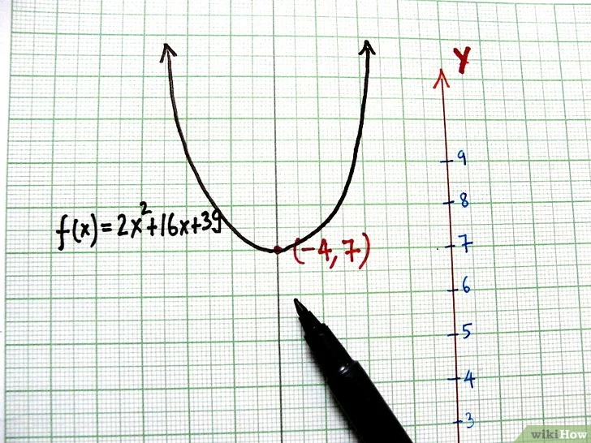

# Linkedin 1 \~ 25

## 244 Shortest Word Distance II

```java
Input
["WordDistance", "shortest", "shortest"]
[[["practice", "makes", "perfect", "coding", "makes"]], ["coding", "practice"], ["makes", "coding"]]
Output
[null, 3, 1]

Explanation
WordDistance wordDistance = new WordDistance(["practice", "makes", "perfect", "coding", "makes"]);
wordDistance.shortest("coding", "practice"); // return 3
wordDistance.shortest("makes", "coding");    // return 1

class WordDistance {
    
    private Map<String, List<Integer>> map;

    public WordDistance(String[] words) {
        // 构造器中先把单词（可能有重复）的各自下标进行预处理
        map = new HashMap<String, List<Integer>>();
        for(int i = 0; i < words.length; i++) {
            String word = words[i];
            if(map.containsKey(word)) {
                map.get(word).add(i);
            } else {
                List<Integer> list = new ArrayList<Integer>();
                list.add(i);
                map.put(word, list);
            }
        }
    }

    public int shortest(String word1, String word2) {
        // 对比两个list之间各元素的最小差值
        List<Integer> list1 = map.get(word1);
        List<Integer> list2 = map.get(word2);
        int distance = Integer.MAX_VALUE;
        // list 1 and list 2 already sorted!
        for(int i = 0, j = 0; i < list1.size() && j < list2.size(); ) {// 分号
            int index1 = list1.get(i), index2 = list2.get(j);
            //distance = Math.min(distance, Math.abs(index1 - index2));
            if(index1 < index2) {
                distance = Math.min(distance, index2 - index1);
                i++;
            } else {
                distance = Math.min(distance, index1 - index2);
                j++;
            }
        }
        return distance;
    }
}
```

## 272: Closest Binary Search Tree Value II

```java
Given the root of a binary search tree, a target value, and an integer k, 
return the k values in the BST that are closest to the target. 
You may return the answer in any order.

Input: root = [4,2,5,1,3], target = 3.714286, k = 2
Output: [4,3]

class Solution {
  public List<Integer> closestKValues(TreeNode root, double target, int k) {
  List<Integer> res = new ArrayList<>();

  Stack<Integer> s1 = new Stack<>(); // predecessors
  Stack<Integer> s2 = new Stack<>(); // successors

  inorder(root, target, false, s1);
  inorder(root, target, true, s2);
  
  while (k-- > 0) {
    if (s1.isEmpty())
      res.add(s2.pop());
    else if (s2.isEmpty())
      res.add(s1.pop());
    else if (Math.abs(s1.peek() - target) < Math.abs(s2.peek() - target))
      res.add(s1.pop());
    else
      res.add(s2.pop());
  }
  
  return res;
}

// inorder traversal  inorder traversal gives us sorted predecessors, 
whereas reverse-inorder traversal gives us sorted successors.
void inorder(TreeNode root, double target, boolean reverse, 
                                           Stack<Integer> stack) {
  if (root == null) return;

  inorder(reverse ? root.right : root.left, target, reverse, stack);
  // early terminate, no need to traverse the whole tree
  if ((reverse && root.val <= target) || (!reverse && root.val > target)) return;
  // track the value of current node
  stack.push(root.val);
  inorder(reverse ? root.left : root.right, target, reverse, stack);
}
}
//Closest Binary Search Tree Value 1(only return cloest)
class Solution {
    int res = 0;
    public int closestValue(TreeNode root, double target) {
        res = root.val;
        traverse(root, target);
        return res;
    }
    
    public void traverse(TreeNode root, double target){
        if(root == null) return;
        if(Math.abs(root.val - target) < Math.abs(res - target)){
            res = root.val;
        }
        if(root.val < target){
            traverse(root.right, target);
        } else {
            traverse(root.left, target);
        }
    }
}
// Successor
class Solution {
    public TreeNode inorderSuccessor(TreeNode root, TreeNode p) {
    TreeNode res = null;
    while(root!=null) {
        if(root.val > p.val) {
        	res = root;
        	root = root.left;
        }
        else root = root.right;
    }
    return res;
}
}

```

## 364 Nested List Weight Sum II


You are given a nested list of integers `nestedList`. Each element is either an integer or a list whose elements may also be integers or other lists.

The **depth** of an integer is the number of lists that it is inside of. For example, the nested list `[1,[2,2],[[3],2],1]` has each integer's value set to its **depth**. Let `maxDepth` be the **maximum depth** of any integer.

The **weight** of an integer is `maxDepth - (the depth of the integer) + 1`.

Return _the sum of each integer in_ `nestedList` _multiplied by its **weight**_.

**Example 1:**


```java
Input: nestedList = [[1,1],2,[1,1]]
Output: 8
Explanation: Four 1's with a weight of 1, one 2 with a weight of 2.
1*1 + 1*1 + 2*2 + 1*1 + 1*1 = 8

class Solution {
   public int depthSumInverse(List<NestedInteger> nestedList) {
        if (nestedList == null) return 0;
        Queue<NestedInteger> queue = new LinkedList<NestedInteger>();
        int prev = 0;
        int total = 0;
        for (NestedInteger next: nestedList) {
            queue.offer(next);
        }
        
        while (!queue.isEmpty()) {
            int size = queue.size();
            int levelSum = 0;
            for (int i = 0; i < size; i++) {
                NestedInteger current = queue.poll();
                if (current.isInteger()) levelSum += current.getInteger();
                List<NestedInteger> nextList = current.getList();
                if (nextList != null) {
                    for (NestedInteger next: nextList) {
                        queue.offer(next);
                    }
                }
            }
            prev += levelSum;
            total += prev;
        }
        return total;
    }
}

```

## 339 Nested List Weight Sum

&#x20;

**Example 1:**


```java
You are given a nested list of integers nestedList. 
Each element is either an integer or a list
 whose elements may also be integers or other lists.
The depth of an integer is the number of lists that it is inside of. 
For example, the nested list [1,[2,2],[[3],2],1] 
has each integer's value set to its depth.
Return the sum of each integer in nestedList multiplied by its depth.

class Solution {
    int result;
    public int depthSum(List<NestedInteger> nestedList) {
        result = 0;
        dfs(nestedList, 1);
        return result;
    }
    private void dfs(List<NestedInteger> nestedList, int depth) {
        for (NestedInteger ni : nestedList) {
            if (ni.isInteger()) {
                result += ni.getInteger() * depth;
            } else {
                dfs(ni.getList(), depth + 1);
            }
        }
    }
}java

```

## 156 Binary Tree Upside Down


Given the `root` of a binary tree, turn the tree upside down and return _the new root_.

You can turn a binary tree upside down with the following steps:

1. The original left child becomes the new root.
2. The original root becomes the new right child.
3. The original right child becomes the new left child.


The mentioned steps are done level by level. It is **guaranteed** that every right node has a sibling (a left node with the same parent) and has no children.

**Example 1:**


```java
Input: root = [1,2,3,4,5]
Output: [4,5,2,null,null,3,1]
// solution 1:
public TreeNode upsideDownBinaryTree(TreeNode root) {
    if(root == null || root.left == null) {
        return root;
    }
    
    TreeNode newRoot = upsideDownBinaryTree(root.left);
    root.left.left = root.right;   // node 2 left children
    root.left.right = root;         // node 2 right children
    root.left = null;
    root.right = null;
    return newRoot;
}

// solution 2:
public TreeNode upsideDownBinaryTree(TreeNode root) {
    TreeNode curr = root;
    TreeNode next = null;
    TreeNode temp = null;
    TreeNode prev = null;
    
    while(curr != null) {
        next = curr.left;
        // swapping nodes now, need temp to keep the previous right child
        curr.left = temp;
        temp = curr.right;
        curr.right = prev;
        prev = curr;
        curr = next;
    }
    return prev;
}  

```

## 360 Sort Transformed Array



```
Given a sorted integer array nums and three integers a, b and c, 
apply a quadratic function of the 
form f(x) = ax2 + bx + c to each element nums[i] in the array, 
and return the array in a sorted order.
Example 1:
Input: nums = [-4,-2,2,4], a = 1, b = 3, c = 5
Output: [3,9,15,33]
Example 2:
Input: nums = [-4,-2,2,4], a = -1, b = 3, c = 5
Output: [-23,-5,1,7]

顶点： X = -b / 2a; Y = f(x);
如果“a”(x2的系数)是正的，那么抛物线的开口就是朝上的，反之就是朝下的。 
也就是把开口朝上的抛物线上下颠倒。


public class Solution {
    public int[] sortTransformedArray(int[] nums, int a, int b, int c) {
        int n = nums.length;
        int[] sorted = new int[n];
        int i = 0, j = n - 1;
        int index = a >= 0 ? n - 1 : 0;
        while (i <= j) {
            if (a >= 0) {
                sorted[index--] = 
                quad(nums[i], a, b, c) >= quad(nums[j], a, b, c) ? 
                quad(nums[i++], a, b, c) : quad(nums[j--], a, b, c);
            } else {
                sorted[index++] = 
                quad(nums[i], a, b, c) >= quad(nums[j], a, b, c) ? 
                quad(nums[j--], a, b, c) : quad(nums[i++], a, b, c);
            }
        }
        return sorted;
    }
    
    private int quad(int x, int a, int b, int c) {
        return a * x * x + b * x + c;
    }
}

class Solution {
    public int[] sortTransformedArray(int[] nums, int a, int b, int c) {
        if (nums.length == 0 || nums == null)
            return new int[0];
        int n = nums.length;
        int[] res = new int[n];
        if (a == 0) {
            for (int i = 0; i < n; i++) {
                int cur = b >= 0 ? nums[i] : nums[n - 1 - i];
                res[i] = b * cur + c;
            }
            return res;
        }
        //sort based on distance to pivot
        double pivot = (double) -b / (2 * a);
        int[] distSorted = new int[n];
        int lo = 0, hi = n - 1, end = n - 1;
        while (lo <= hi) { 
            double d1 = pivot - nums[lo], d2 = nums[hi] - pivot;
            if (d1 > d2) {
                distSorted[end--] = nums[lo++];
            } else {
                distSorted[end--] = nums[hi--];
            }
        }
        //populate res based on distSorted, and also a
        for (int i = 0; i < n; i++) {
            int cur = a > 0 ? distSorted[i] : distSorted[n - 1 - i];
            res[i] = a * cur * cur + b * cur + c;
        }
        return res;
    }
}
```

## 297: Serialize and Deserialize Binary Tree

```java
public class Codec {
    // Encodes a tree to a single string.
    public String spliter = ",";
    public String nulval = "null";
    public String serialize(TreeNode root) {
        StringBuilder sb = new StringBuilder();
        if(root == null) return sb.append(nulval).toString();
        serializeHelper(root,sb);
        return sb.toString();
    }
    
    public void serializeHelper(TreeNode node, StringBuilder sb) {
        if(node == null) {
            sb.append(nulval).append(spliter);// don't forget.append(spliter)
            return;
        }
        sb.append(node.val).append(spliter);
        serializeHelper(node.left, sb);
        serializeHelper(node.right, sb);
    }

    // Decodes your encoded data to tree.
    public TreeNode deserialize(String data) {
        Queue<String> queue = new LinkedList<>();
        queue.addAll(Arrays.asList(data.split(spliter)));
        return deserializeHelper(queue);
        
    }
    public TreeNode deserializeHelper(Queue<String> queue) {
        String cur = queue.poll();// get value first then check.
        if (cur.equals(nulval)) {
            return null;
        } 
        TreeNode node = new TreeNode(Integer.valueOf(cur));
        node.left = deserializeHelper(queue);
        node.right = deserializeHelper(queue);
        return node; 
    }
}
}

```

## 366 Find Leaves of Binary Tree


Given the `root` of a binary tree, collect a tree's nodes as if you were doing this:

* Collect all the leaf nodes.
* Remove all the leaf nodes.
* Repeat until the tree is empty.

**Example 1:**


```
Input: root = [1,2,3,4,5]
Output: [[4,5,3],[2],[1]]
Explanation:
[[3,5,4],[2],[1]] and [[3,4,5],[2],[1]] are also considered correct answers since per each level it does not matter the order on which elements are returned.
```

```
class Solution {
    
    List<List<Integer>> res = new ArrayList<>();
    HashMap<Integer, List<Integer>> map = new HashMap<>();
    
    public List<List<Integer>> findLeaves(TreeNode root) {
        if(root == null) return res;
        findMaxDistance(root);
        for(int i = 0; i < map.size(); i ++){
            res.add(map.get(i));
        }
        return res;
    }
    
    public int findMaxDistance(TreeNode root){
        if(root == null) return -1;
        int left = findMaxDistance(root.left);
        int right = findMaxDistance(root.right);
        int cur = Math.max(left, right) + 1;
        if(!map.containsKey(cur)){
            List<Integer> curLevel = new ArrayList<>();
            curLevel.add(root.val);
            map.put(cur, curLevel);
        } else {
            map.get(cur).add(root.val);
        }
        
        return cur;
        
    }
}
```

## 380 Insert Delete GetRandom O(1)

Implement the `RandomizedSet` class:

* `RandomizedSet()` Initializes the `RandomizedSet` object.
* `bool insert(int val)` Inserts an item `val` into the set if not present. Returns `true` if the item was not present, `false` otherwise.
* `bool remove(int val)` Removes an item `val` from the set if present. Returns `true` if the item was present, `false` otherwise.
* `int getRandom()` Returns a random element from the current set of elements (it's guaranteed that at least one element exists when this method is called). Each element must have the **same probability** of being returned.

You must implement the functions of the class such that each function works in **average** `O(1)` time complexity.

**Example 1:**

```
Input
["RandomizedSet", "insert", "remove", "insert", "getRandom", "remove", "insert", "getRandom"]
[[], [1], [2], [2], [], [1], [2], []]
Output
[null, true, false, true, 2, true, false, 2]
```

\


```
public class RandomizedSet {
    ArrayList<Integer> nums;
    HashMap<Integer, Integer> locs;
    java.util.Random rand = new java.util.Random();
    /** Initialize your data structure here. */
    public RandomizedSet() {
        nums = new ArrayList<Integer>();
        locs = new HashMap<Integer, Integer>();
    }
    
    /** Inserts a value to the set. Returns true if the set did not already contain the specified element. */
    public boolean insert(int val) {
        boolean contain = locs.containsKey(val);
        if ( contain ) return false;
        locs.put( val, nums.size());
        nums.add(val);
        return true;
    }
    
    /** Removes a value from the set. Returns true if the set contained the specified element. */
    public boolean remove(int val) {
        boolean contain = locs.containsKey(val);
        if ( ! contain ) return false;
        int loc = locs.get(val);
        if (loc < nums.size() - 1 ) { // not the last one than swap the last one with this val
            int lastone = nums.get(nums.size() - 1 );
            nums.set( loc , lastone );
            locs.put(lastone, loc);
        }
        locs.remove(val);
        nums.remove(nums.size() - 1);
        return true;
    }
    
    /** Get a random element from the set. */
    public int getRandom() {
        return nums.get( rand.nextInt(nums.size()) );
    }
}
```

## 2040 Kth Smallest Product of Two Sorted Arrays

Given two **sorted 0-indexed** integer arrays `nums1` and `nums2` as well as an integer `k`, return _the_ `kth` _(**1-based**) smallest product of_ `nums1[i] * nums2[j]` _where_ `0 <= i < nums1.length` _and_ `0 <= j < nums2.length`.

```
Input: nums1 = [2,5], nums2 = [3,4], k = 2
Output: 8
Explanation: The 2 smallest products are:
- nums1[0] * nums2[0] = 2 * 3 = 6
- nums1[0] * nums2[1] = 2 * 4 = 8
The 2nd smallest product is 8.
```

```java
class Solution {
    static long INF = (long) 1e10;
    public long kthSmallestProduct(int[] nums1, int[] nums2, long k) {
        int m = nums1.length, n = nums2.length;
        long lo = -INF - 1, hi = INF + 1;
        while (lo < hi) {            
            long mid = lo + ((hi - lo) >> 1), cnt = 0;
            for (int i : nums1) {
                if (0 <= i) {
                    int l = 0, r = n - 1, p = 0;
                    while (l <= r) {
                        int c = l + ((r - l) >> 1);
                        long mul = i * (long) nums2[c];
                        if (mul <= mid) {
                            p = c + 1;
                            l = c + 1;
                        } else r = c - 1;
                    }
                    cnt += p;
                } else {
                    int l = 0, r = n - 1, p = 0;
                    while (l <= r) {
                        int c = l + ((r - l) >> 1);
                        long mul = i * (long) nums2[c];
                        if (mul <= mid) {
                            p = n - c;
                            r = c - 1;
                        } else l = c + 1;
                    }
                    cnt += p;
                }
            }
            if (cnt >= k) {
                hi = mid;
            } else lo = mid + 1L;
        }
        return lo;
    }
}
```

## 671 Second Minimum Node In a Binary Tree

Given a non-empty special binary tree consisting of nodes with the non-negative value, where each node in this tree has exactly `two` or `zero` sub-node. If the node has two sub-nodes, then this node's value is the smaller value among its two sub-nodes. More formally, the property `root.val = min(root.left.val, root.right.val)` always holds.

Given such a binary tree, you need to output the **second minimum** value in the set made of all the nodes' value in the whole tree.

If no such second minimum value exists, output -1 instead.

&#x20;

**Example 1:**


```java
class Solution {
    // 定义：输入一棵二叉树，返回这棵二叉树中第二小的节点值
    public int findSecondMinimumValue(TreeNode root) {
        if (root.left == null && root.right == null) {
            return -1;
        }
        // 左右子节点中不同于 root.val 的那个值可能是第二小的值
        int left = root.left.val, right = root.right.val;
        // 如果左右子节点都等于 root.val，则去左右子树递归寻找第二小的值
        if (root.val == root.left.val) {
            left = findSecondMinimumValue(root.left);
        }
        if (root.val == root.right.val) {
            right = findSecondMinimumValue(root.right);
        }
        if (left == -1) {
            return right;
        }
        if (right == -1) {
            return left;
        }
        // 如果左右子树都找到一个第二小的值，更小的那个是整棵树的第二小元素
        return Math.min(left, right);
    }
}
```

## 150 Evaluate Reverse Polish Notation


Evaluate the value of an arithmetic expression in [Reverse Polish Notation](http://en.wikipedia.org/wiki/Reverse\_Polish\_notation).

Valid operators are `+`, `-`, `*`, and `/`. Each operand may be an integer or another expression.

**Note** that division between two integers should truncate toward zero.

It is guaranteed that the given RPN expression is always valid. That means the expression would always evaluate to a result, and there will not be any division by zero operation.

```java
Input: tokens = ["2","1","+","3","*"]
Output: 9
Explanation: ((2 + 1) * 3) = 9
ava
class Solution {
   public  int evalRPN(String[] tokens) {
        Stack<Integer> st = new Stack<>();
        for (int i = 0; i < tokens.length; i ++) {
          //  if("+-*/".contains(tokens[i])){
            if(tokens[i].equals("+")  || tokens[i].equals("-")  || tokens[i].equals("*" )  || tokens[i].equals("/")){
                int num2 = st.pop();
                int num1 = st.pop();
                int cur = getNum(num1, num2, tokens[i]);
                st.push(cur);
            } else {
                st.push(Integer.parseInt(tokens[i]));
            }
        }
        return st.pop();
    }

    public  int getNum(int num1, int num2, String operator){
        switch(operator){
            case "+":
                return num1 + num2;
            case "-":
                return num1 - num2;
            case "*":
                return num1 * num2;
            case "/":
                return num1 / num2;
            default :
                return 0;
        }
    }
}

```

## 53 Maximum Subarray

Given an integer array `nums`, find the contiguous subarray (containing at least one number) which has the largest sum and return _its sum_.

A **subarray** is a **contiguous** part of an array.

```java
Input: nums = [-2,1,-3,4,-1,2,1,-5,4]
Output: 6
Explanation: [4,-1,2,1] has the largest sum = 6.

class Solution {
int maxSubArray(int[] nums) {
    int n = nums.length;
    if (n == 0) return 0;
    int[] dp = new int[n];
    // base case
    // 第一个元素前面没有子数组
    dp[0] = nums[0];
    // 状态转移方程
    for (int i = 1; i < n; i++) {
        dp[i] = Math.max(nums[i], nums[i] + dp[i - 1]);
    }
    // 得到 nums 的最大子数组
    int res = Integer.MIN_VALUE;
    for (int i = 0; i < n; i++) {
        res = Math.max(res, dp[i]);
    }
    return res;
  }
}

```

## 65 Valid Number


A **valid number** can be split up into these components (in order):

1. A **decimal number** or an **integer**.
2. (Optional) An `'e'` or `'E'`, followed by an **integer**.

A **decimal number** can be split up into these components (in order):

1. (Optional) A sign character (either `'+'` or `'-'`).
2.  One of the following formats:

    1. One or more digits, followed by a dot `'.'`.
    2. One or more digits, followed by a dot `'.'`, followed by one or more digits.
    3. A dot `'.'`, followed by one or more digits.

    An **integer** can be split up into these components (in order):

    1. (Optional) A sign character (either `'+'` or `'-'`).
    2. One or more digits.

```java
将字符串以 e/E 进行分割后，其实规则十分简单：
如果存在 e/E ：左侧可以「整数」或「浮点数」，右侧必须是「整数」
如果不存在 e/E ：整段可以是「整数」或「浮点数」
关键在于如何实现一个 check 函数用于判断「整数」或「浮点数」：

+/- 只能出现在头部
. 最多出现一次
至少存在一个数字


class Solution {
    public boolean isNumber(String s) {
        int n = s.length();
        char[] cs = s.toCharArray();
        int idx = -1;
        for (int i = 0; i < n; i++) {
            if (cs[i] == 'e' || cs[i] == 'E') {
                if (idx == -1) idx = i;
                else return false;
            }
        }
        boolean ans = true;
        if (idx != -1) {
            ans &= check(cs, 0, idx - 1, false);
            ans &= check(cs, idx + 1, n - 1, true);
        } else {
            ans &= check(cs, 0, n - 1, false);
        }
        return ans;
    }
    boolean check(char[] cs, int start, int end, boolean mustInteger) {
        if (start > end) return false;
        if (cs[start] == '+' || cs[start] == '-') start++;
        boolean hasDot = false, hasNum = false;
        for (int i = start; i <= end; i++) {
            if (cs[i] == '.') {
                if (mustInteger || hasDot) return false;
                hasDot = true;
            } else if (cs[i] >= '0' && cs[i] <= '9') {
                hasNum = true;
            } else {
                return false;
            }
        }
        return hasNum;
    }
}


```

## 341 Flatten Nested List Iterator


ou are given a nested list of integers `nestedList`. Each element is either an integer or a list whose elements may also be integers or other lists. Implement an iterator to flatten it.

Implement the `NestedIterator` class:

* `NestedIterator(List<NestedInteger> nestedList)` Initializes the iterator with the nested list `nestedList`.
* `int next()` Returns the next integer in the nested list.
* `boolean hasNext()` Returns `true` if there are still some integers in the nested list and `false` otherwise.

Your code will be tested with the following pseudocode:

```
initialize iterator with nestedList
res = []
while iterator.hasNext()
    append iterator.next() to the end of res
return res
```

If `res` matches the expected flattened list, then your code will be judged as correct.

```java
Input: nestedList = [[1,1],2,[1,1]]
Output: [1,1,2,1,1]
Explanation: By calling next repeatedly until hasNext
 returns false, the order of elements returned by next should be: [1,1,2,1,1].
 
 public class NestedIterator implements Iterator<Integer> {
    private List<Integer> listIterator;
    private int index;

    public NestedIterator(List<NestedInteger> nestedList) {
        listIterator = getListIterator(nestedList);
        index = 0;
    }

    @Override
    public Integer next() {
        if (hasNext()){
            Integer val = listIterator.get(index ++);
            return val;
        }
        return null;
    }

    @Override
    public boolean hasNext() {
        return index  < listIterator.size();
        
        
    }
    
    public static List<Integer> getListIterator(List<NestedInteger> nestedList) {
        ArrayList<Integer> res = new ArrayList<>();
        for (NestedInteger val : nestedList) {
            if (val.isInteger()) {
                res.add(val.getInteger());
            } else {
                res.addAll(getListIterator(val.getList()));
            }
        }
        return res;
    }
    
}
```

## 33 Search in Rotated Sorted Array

There is an integer array `nums` sorted in ascending order (with **distinct** values).

Prior to being passed to your function, `nums` is **possibly rotated** at an unknown pivot index `k` (`1 <= k < nums.length`) such that the resulting array is `[nums[k], nums[k+1], ..., nums[n-1], nums[0], nums[1], ..., nums[k-1]]` (**0-indexed**). For example, `[0,1,2,4,5,6,7]` might be rotated at pivot index `3` and become `[4,5,6,7,0,1,2]`.

Given the array `nums` **after** the possible rotation and an integer `target`, return _the index of_ `target` _if it is in_ `nums`_, or_ `-1` _if it is not in_ `nums`.

You must write an algorithm with `O(log n)` runtime complexity.

```java
class Solution { 
        public int search(int[] nums, int target) {
        if (nums == null || nums.length == 0){return -1;}
        int start = 0;
        int end = nums.length - 1;
        int mid;
        while (start <= end) {
             mid = start + (end - start) /2;
            if (nums[mid] == target) {return mid;}
            if (nums[start] <= nums[mid]){
                if(target >= nums[start] && target < nums[mid]){
                    end = mid - 1;
                } else {
                    start = mid + 1;
                }
            } else {
                if(target <= nums[end] && nums[mid] < target ){
                    start = mid + 1;
                } else {
                    end = mid - 1;
                }
            }
        }
        return -1;
    }
}
```

## 277 Find the Celebrity

Suppose you are at a party with `n` people labeled from `0` to `n - 1` and among them, there may exist one celebrity. The definition of a celebrity is that all the other `n - 1` people know the celebrity, but the celebrity does not know any of them.

Now you want to find out who the celebrity is or verify that there is not one. The only thing you are allowed to do is ask questions like: "Hi, A. Do you know B?" to get information about whether A knows B. You need to find out the celebrity (or verify there is not one) by asking as few questions as possible (in the asymptotic sense).

You are given a helper function `bool knows(a, b)` that tells you whether A knows B. Implement a function `int findCelebrity(n)`. There will be exactly one celebrity if they are at the party.

Return _the celebrity's label if there is a celebrity at the party_. If there is no celebrity, return `-1`.


```
Input: graph = [[1,1,0],[0,1,0],[1,1,1]]
Output: 1
Explanation: There are three persons labeled with 0, 1 and 2. 
graph[i][j] = 1 means person i knows person j,
 otherwise graph[i][j] = 0 means person i does not know person j. 
 The celebrity is the person labeled as 1 because both 0 and 2 know him 
 but 1 does not know anybody.
 
 
```

```java
public class Solution extends Relation {
    public int findCelebrity(int n) {
        if (n < 0) {
            return -1;
        } 
        
        // 找到出度为0的人，也就是不认识任何别人的人
        int candidate = 0;
        for (int i = 0; i < n; i++) {
            if (knows(candidate, i)) {
                candidate = i;
            }
        }
        
        // 看看是不是所有人都认识他 和 是否他不认识所有人
        for (int i = 0; i < n; i++) {
            if (i != candidate) { // 自己不和自己比较
                if (!knows(i, candidate)) { // 有人不认识他
                    return -1;
                }
                if (knows(candidate, i)) {// 他认识某人
                    return -1;
                }
            }
        }
        return candidate;
    }
}
```

## 20 Valid Parentheses

```
Input: s = "()[]{}"
Output: true

class Solution {
    public boolean isValid(String s) {
        if (s == null || s.length() == 0) return true;
        Stack<Character> stack = new Stack<>();
        for (char c : s.toCharArray()){
            if (c == '(' || c == '{' || c == '['){
                stack.push(c);
            }
            if (stack.isEmpty()) return false;
            if ((c == ')' && stack.pop() != '(') ||
                (c == '}' && stack.pop() != '{') ||
                (c == ']' && stack.pop() != '[') ) {
                return false;
            }
        }
        if (!stack.isEmpty()) return false;
        return true;
    }
}
```

## 235 Lowest Common Ancestor of a Binary Search Tree

```java

class Solution {
    public TreeNode lowestCommonAncestor(TreeNode root, TreeNode p, TreeNode q) {
        if(root.val > p.val && root.val > q.val){
            return lowestCommonAncestor(root.left, p, q);
        }else if(root.val < p.val && root.val < q.val){
            return lowestCommonAncestor(root.right, p, q);
        }else{
            return root;
        }
        
    }
}
```

## 215 Kth Largest Element in an Array

```
class Solution {
    public int findKthLargest(int[] nums, int k) {

     PriorityQueue<Integer> pq = new PriorityQueue<>();
    for(int val : nums) {
        pq.offer(val);
        if(pq.size() > k) {
            pq.poll();
        }
    }
    return pq.peek();
}
}
```

## 200 Number of islands

```
class Solution {
    public int numIslands(char[][] grid) {
        int[][] directions = {{-1, 0}, {0, -1}, {1, 0}, {0, 1}};
        int r = grid.length;
        int c = grid[0].length;
        boolean[] marked = new boolean[r * c];
        int count = 0;
        for (int i = 0; i < r; i ++) {
            for (int j = 0; j < c; j ++) {
             if (!marked[i * c + j] && grid[i][j] == '1') {
                 count++;
                 int index = i * c + j;
                 LinkedList<Integer> queue = new LinkedList<>();
                 queue.offer(index);
                 marked[i * c + j] = true;
                 while (!queue.isEmpty()) {
                     int cur = queue.poll();
                     int curX = cur / c;
                     int curY = cur % c;
                     for (int k = 0; k < 4; k ++) {
                        int nextX = curX + directions[k][0];
                        int  nextY = curY + directions[k][1];
                         if (inArea(r,c,nextX, nextY) && grid[nextX][nextY] == '1' && !marked[nextX * c + nextY]){
                             queue.offer(nextX * c + nextY);
                             marked[nextX * c + nextY] = true;
                         }
                     }
                 }   
             } 
            }
        }
        
        return count;
        
    }
    
    public boolean inArea(int r, int c, int i, int j) {
        return i >= 0 && i < r && j >= 0 && j < c;
    }
}
```

```
class Solution {
    int[][] dis = new int[][]{{-1, 0}, {0, -1}, {0, 1}, {1, 0}};
    public int numIslands(char[][] grid) {
        if (grid == null || grid.length == 0) return 0;
        int total = 0;
        for (int r = 0; r < grid.length; r ++) {
            for (int c = 0; c < grid[0].length; c++) {
                if (grid[r][c] == '1') {
                    searchArea(grid, r , c);
                    total ++;
                }
            }
        }
        return total;
    }
    
    private void searchArea(char[][] grid, int r, int c){
        if(!inArea(grid,r,c)){
            return;
        }
        if(grid[r][c] != '1'){
            return;
        }
        grid[r][c] = '2';
        for (int i = 0; i < 4; i ++){
            int nextR = r + dis[i][0];
            int nextC = c + dis[i][1];
            searchArea(grid, nextR, nextC);
        }
            
        
    }
    
    private boolean inArea(char[][] grid, int r, int c){
        return r >= 0 && r < grid.length && c >= 0 && c < grid[0].length;
    }
}
```

```
public class Solution {
       int[][] distance = {{1,0},{-1,0},{0,1},{0,-1}};
    public int numIslands(char[][] grid) {  
        if (grid == null || grid.length == 0 || grid[0].length == 0)  {
            return 0;  
        }
        UnionFind uf = new UnionFind(grid);  
        int rows = grid.length;  
        int cols = grid[0].length;  
        for (int i = 0; i < rows; i++) {  
            for (int j = 0; j < cols; j++) {  
                if (grid[i][j] == '1') {  
                    for (int[] d : distance) {
                        int x = i + d[0];
                        int y = j + d[1];
                        if (x >= 0 && x < rows && y >= 0 && y < cols && grid[x][y] == '1') {  
                            int id1 = i*cols+j;
                            int id2 = x*cols+y;
                            uf.union(id1, id2);  
                        }  
                    }  
                }  
            }  
        }  
        return uf.count;  
    }
    
    class UnionFind {
        int[] father;  
        int m, n;
        int count = 0;
        UnionFind(char[][] grid) {  
            m = grid.length;  
            n = grid[0].length;  
            father = new int[m*n];  
            for (int i = 0; i < m; i++) {  
                for (int j = 0; j < n; j++) {  
                    if (grid[i][j] == '1') {
                        int id = i * n + j;
                        father[id] = id;
                        count++;
                    }
                }  
            }  
        }
        public void union(int node1, int node2) {  
            int find1 = find(node1);
            int find2 = find(node2);
            if(find1 != find2) {
                father[find1] = find2;
                count--;
            }
        }
        public int find (int node) {  
            if (father[node] == node) {  
                return node;
            }
            father[node] = find(father[node]);  
            return father[node];
        }
    }
}

```

## 104 Maximum Depth of Binary Tree

```
class Solution {
    public int maxDepth(TreeNode root) {   
        return (root == null) ? 0 : 
        (1 + Math.max(maxDepth(root.left), maxDepth(root.right)));  
    }
}
```

## 636 Exclusive Time of Functions

```java
函数的独占时间
有一个 单线程 CPU 正在运行一个含有 n 道函数的程序。每道函数都有一个位于  0 和 n-1 
之间的唯一标识符。

函数调用 存储在一个 调用栈 上 ：当一个函数调用开始时，它的标识符将会推入栈中。
而当一个函数调用结束时，它的标识符将会从栈中弹出。标识符位于栈顶的函数是 当前正在执行的函数 。
每当一个函数开始或者结束时，将会记录一条日志，包括函数标识符、是开始还是结束、以及相应的时间戳。

给你一个由日志组成的列表 logs ，其中 logs[i] 表示第 i 条日志消息，
该消息是一个按 "{function_id}:{"start" | "end"}:{timestamp}" 进行格式化的字符串。
例如，"0:start:3" 意味着标识符为 0 的函数调用在时间戳 3 的 起始开始执行 ；而 "1:end:2" 
意味着标识符为 1 的函数调用在时间戳 2 的 末尾结束执行。注意，函数可以 调用多次，
可能存在递归调用 。

函数的 独占时间 定义是在这个函数在程序所有函数调用中执行时间的总和，
调用其他函数花费的时间不算该函数的独占时间。例如，如果一个函数被调用两次，
一次调用执行 2 单位时间，另一次调用执行 1 单位时间，那么该函数的 独占时间 为 2 + 1 = 3 。
以数组形式返回每个函数的 独占时间 ，其中第 i 个下标对应的值表示标识符 i 的函数的独占时间。
示例 1：
输入：n = 2, logs = ["0:start:0","1:start:2","1:end:5","0:end:6"]
输出：[3,4]
解释：
函数 0 在时间戳 0 的起始开始执行，执行 2 个单位时间，于时间戳 1 的末尾结束执行。 
函数 1 在时间戳 2 的起始开始执行，执行 4 个单位时间，于时间戳 5 的末尾结束执行。 
函数 0 在时间戳 6 的开始恢复执行，执行 1 个单位时间。 
所以函数 0 总共执行 2 + 1 = 3 个单位时间，函数 1 总共执行 4 个单位时间。 

// Some code
用一个栈模拟函数的执行过程，每个函数用一个二元数组表示[id, startTime]；
当遇见一个标志为id : start : time的函数记录时，如果栈顶仍有其他正在执行的函数，
那么根据单线程的原理，栈顶函数要停下来，相当于它在time-1时刻停止执行了，
我们将这个执行时间记录到它的结果中，同时将新函数压入栈；
当遇见一个标志为id : end : time的函数记录时，此时栈顶一定是当前函数，那么弹出栈顶元素，
记录执行时长。同时，恢复原函数的执行，它的起始执行时间是time+1时刻，
此时我们直接更改栈顶元素的startTime = time + 1即可。


class Solution {
        public int[] exclusiveTime(int n, List<String> logs) {
            Deque<Log> stack = new ArrayDeque<>();
            int[] result = new int[n];
            for (String content : logs) {
                Log log = new Log(content);
                if (log.isStart) {
                    stack.push(log);
                } else {
                    Log top = stack.pop();
                    result[top.id] += (log.time - top.time + 1 - top.subDuration);
                    if (!stack.isEmpty()) {
                        stack.peek().subDuration += (log.time - top.time + 1);
                    }
                }
            }
            return result;
        }

        public static class Log {
            public int id;
            public boolean isStart;
            public int time;
            public int subDuration;

            public Log(String content) {
                String[] strs = content.split(":");
                id = Integer.valueOf(strs[0]);
                isStart = strs[1].equals("start");
                time = Integer.valueOf(strs[2]);
                subDuration = 0;
            }
        }
}

public int[] exclusiveTime(int n, List<String> logs) {
    // separate time to several intervals, add interval to their function
    int[] result = new int[n];
    Stack<Integer> st = new Stack<>();
    int pre = 0;
    // pre means the start of the interval
    for(String log: logs) {
        String[] arr = log.split(":");
        if(arr[1].equals("start")) {
            if(!st.isEmpty())  
            result[st.peek()] += Integer.parseInt(arr[2]) - pre;
            // arr[2] is the start of next interval, doesn't belong to current 
            //interval.
            st.push(Integer.parseInt(arr[0]));
            pre = Integer.parseInt(arr[2]);
        } else {
            result[st.pop()] += Integer.parseInt(arr[2]) - pre + 1;
            // arr[2] is end of current interval, belong to current interval.
             That's why we have +1 here
            pre = Integer.parseInt(arr[2]) + 1;
            // pre means the start of next interval, so we need to +1
        }
    }
    return result;
}
```

## 102 Binary Tree Level Order Traversal

```java
// Some code
class Solution {
    public List<List<Integer>> levelOrder(TreeNode root) {
        List<List<Integer>> res = new ArrayList<>();
        if(root == null) return res;
        Queue<TreeNode> queue = new LinkedList<>();
        queue.offer(root);
        
        while(!queue.isEmpty()) {
            int size = queue.size();
            List<Integer> curLevel = new ArrayList<>();
            for(int i = 0; i < size; i ++){
                TreeNode cur = queue.poll();
                curLevel.add(cur.val);
                if(cur.left != null) queue.offer(cur.left);
                if(cur.right != null) queue.offer(cur.right);
            }
            res.add(curLevel);
        }
        
        return res;
        
    }
}
```

## 127 Word Ladder


A **transformation sequence** from word `beginWord` to word `endWord` using a dictionary `wordList` is a sequence of words `beginWord -> s1 -> s2 -> ... -> sk` such that:

* Every adjacent pair of words differs by a single letter.
* Every `si` for `1 <= i <= k` is in `wordList`. Note that `beginWord` does not need to be in `wordList`.
* `sk == endWord`

Given two words, `beginWord` and `endWord`, and a dictionary `wordList`, return _the **number of words** in the **shortest transformation sequence** from_ `beginWord` _to_ `endWord`_, or_ `0` _if no such sequence exists._

```java
Input: beginWord = "hit", endWord = "cog",
 wordList = ["hot","dot","dog","lot","log","cog"]
Output: 5
Explanation: One shortest transformation
 sequence is "hit" -> "hot" -> "dot" -> "dog" -> cog", which is 5 words long.
 
 class Solution {
    public int ladderLength(String beginWord, String endWord, 
                            List<String> wordList) {
         HashSet<String> wordSet = new HashSet<>(wordList);
         if(!wordSet.contains(endWord)) return 0;
         Queue<String> queue = new LinkedList<>();
         HashSet<String> visited = new HashSet<>();
         queue.offer(beginWord);
         visited.add(beginWord);
         int steps = 0;
         while (!queue.isEmpty()){
             steps ++;
             int size = queue.size();
             for (int i = 0; i < size; i ++){
                 String word = queue.poll();
                if(word.equals(endWord)) return steps;
                 for (int j = 0; j < word.length(); j ++){
                     char[] letters = word.toCharArray();
                     for (char l = 'a'; l <= 'z'; l ++){
                         letters[j] = l;
                         String nextWord = new String(letters);
                  if(!visited.contains(nextWord) && wordSet.contains(nextWord)){
                             queue.offer(nextWord);
                             visited.add(nextWord);
                         }
                     }
                 }
             }
         }
         return 0;    
         
        
    }
}
```

##
